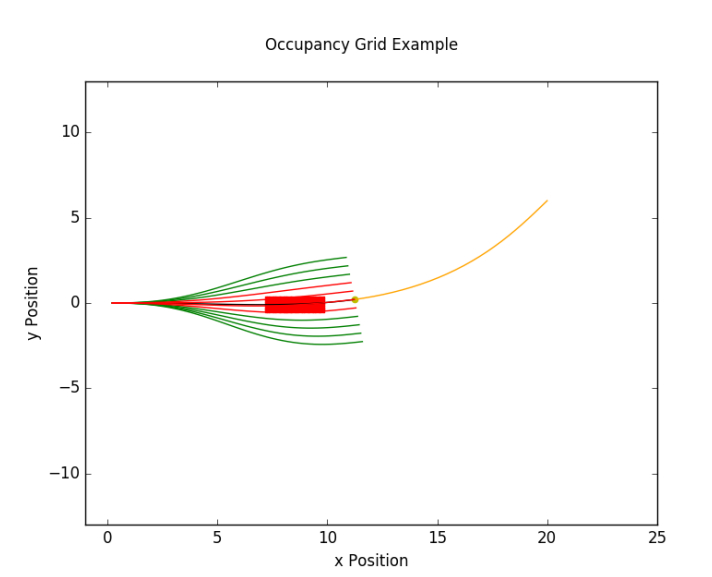

## Module 1: Basics of 3D Computer Vision
This module introduced the richness and challenges of the self-driving motion planning problem, demonstrating a working example that will be built toward throughout this course. The focus will on defining the primary scenarios encountered in driving, types of loss functions and constraints that affect planning, as well as common decomposition of the planning problem into behavior and trajectory planing subproblems. This module introduces a generic, hierarchical motion planning optimization formulation that is further expanded and implemented throughout the subsequent modules. 

- **Behaviours**
  - Speed tracking 
  - Decelerate to Stop
  - Stay stopped
  - Yield
  - Emergency stop

- **Challenges**
  - Only covered a small subset of scenarios.
    - Focused on common cases that follow the rules of the road.
  - Edge cases make the driving task complex (e.g. lane splitting, jay walking)

- **Hierarchical Planning Introduction**
    - Driving mission and scenarios are complex problems.
    - Break them into a hierarchy of optimization problems. 
    - Each optimization problem tailored to the correct scope and level of abstraction.
    - Higher in the hierarchy means more abstraction.
    - Each optimization problem will have constraints and objective functions.
    
</img>
 
    
- **Static Obstacles**   
  - Static obstacles block portions of workspace
    - Occupancy grid encoding stores obstacle locations.
  
  - Static obstacle constrains satisfied by performing collision checking
    - Can check for collisions using th swath of the vehicle's path.
    - Can also check for closet obstacle along ego vehicle' path. 
    
- **Efficiency**    
  - Path length: Minimize the arc length of a path to generate the shortest path to the goal.
  - Travel time: Minimize the time to destination while following the planned path. 

- **Reference Tracking**

- **Smoothness**:

</img>
 

- **Curvature**

</img>
 

- **Hierarchical Planner**
  - **Mission planner**
    - Highest level planner, focuses on map-level navigation.
    - Abstract away lower level details.
    - Can be solved with graph-based methods (Dijkstra's, A*)
    
  - **Behavior planner** 
    - Focuses on other agents, rules of the road, driving behaviors.
    - Decide when it is safe to proceed.
    - Take pedestrians, vehicles, cyclists into consideration.
    - Also looks at regulatory elements, such as traffic lights and stop signs. 
    
    - **Finite State Machines**
      - Composed of state and transitions: _states_ are based on perception of surroundings and _transitions_ are based on inputs to the driving scenarios (e.g. traffic light changing color). 
      - FSM is memoryless: transition only depend on input and current state, and not on past state sequence. 
    
</img>
 
    
    - **Rule-based system**
      - Rule-bases systems use a hierarchy of rules to determine output behavior.
      - Rules are evaluated based on logical predicates.
        - Higher priority rules have precedence. 
      - Example scenario with two rules:
        - Green light + intersection -> drive straight.
        - pedestrian + driving straight -> emergency stop.

    - **Reinforcement Learning**
    
</img>
 
    
    
  - **Local planner**
    - Local planning generates feasible, collision-free paths and comfortable velocity profiles. 
    - Decomposed into path planning and velocity profile generation.
    
    - **Sampling-based planner**
      - Randomly sample the control inputs to quickly explore the workspace.
      - Collision checking is performed as new points are added to the explored space. 
      - Often very fast, but can generate poor-quality paths. 
      - Rapidly Exploring Random Tree (RRT)
      
    - **Variational Planner**  
      - Optimize trajectory according to cost functional
        - Contains penalties for collision avoidance and robot dynamics
      - Variational planners are usually trajectory planners, which means they combine both path planning, and velocity planning into a single step. 
      - Can be slower, and less likely to converge to a feasible solution.
    
    - **Lattice Planners**
      - Constrain the search space by limiting actions available to the robot (set of actions known as control set).
      - Layers of control actions form a graph, which can be searched using Dijkstra's.
      - Conformal lattice planner fits the control actions to the road structure.
      
# Module 2: Mapping for Planning
The occupancy grid is a discretization of space into fixed-sized cells, each of which contains a probability that it is occupied. It is a basic data structure used throughout robotics and alternative to storing full point clouds. This module introduces the occupancy grid and reviews the space and computation requirements of the data structure. In many cases, a 2D occupancy grid is sufficient; learners will examine ways to efficiently compress and filter 3D LIDAR scans to form 2D maps.

- **Ocupancy Grid**
  In the map below, we can see that the squares with trees and grass cover are labeled as one, whereas the road is labeled as zero.
  
</img>
 

- **Range sensor**
  - 2D range sensor measuring distance to static objects.

- **Probabilistic Occupancy Grid**
  - Use to handle sensor noise, environmental noise and map uncertainties.
  - Each cell from Occupancy grid would have a specific probability, and a threshold of certainty will be used to establish occupancy.  
  - To improve robustness multiple timesteps are used to produce the current map.
  - Bayes's theorem is applied for at each update step for each cell.
  - Issue:  
    - Multiplication of numbers close to zero is hard for computers.
    - Store the log odds ratio rather than probability.
  
- **Bayesian Log Odds Single Cell Update Derivation**
  - Numerically stable.
  - Computationally efficient. 
  
</img>
 
  
- **Inverse Measurement Module**
  - The measurement model in the mapping case represents the probability of getting a certain lidar measurement, given a cell in the occupancy grid is occupied.
  - For occupancy grid updates, we need to flip this measurement model around &rightarrow; an inverse measurement model.  

- **Inverse Measurement Module with Ray Tracing**
  - Ray tracing algorithm using Bresenham's line algorithm (fast calculation)
  - Perform update on each beam from the LiDar rather then each cell on the grid:
    - Perform far fewer updates (ignores no information zone).
    - Much cheaper per operation.

- **Filtering of 3D LIDAR**
  - Downsample the number of points of a LiDAR scan to a smaller amount to make update operation run in real-time.
  - Remove objects that don't affect driving (e.g: objects above car height)
  - Remove LiDAR points that hit the ground plane (drivable surface). We can utilize segmentation to remove points of road elements. 
  - Remove Dynamic objects.
  
- **Projection of LIDAR to 2D Plane**
    - **Simple solution**:
      - Collapse all points by zeroing the Z coordinate.
      - Sum up the number of LIDAR points in each grid location:
        - More points indicated greater change of occupation of that grid cell. 

- **High Detailed Road Map**: stores all of the locations of road signs and signals which might effect the autonomous vehicle. Due to the detailed and interconnected nature of the data, an effective method is required to store all information contained within the map. 

- **Lanelet Map**: 
  
</img>
 

  -  **Lanelet Element**: store all information connected to a small longitudinal segment of a lane on a road which it represents. 
    - Defines the following:
      - Left and right boundaries: Define the edges of a driving lane. Different operation can be performed on boundaries such as heading, curvature and center line.
      - Regulation: Elements (e.g. stop sign) and Attributes (e.g. speed limit.)
      - Connectivity to other lanelets.
    - A new lanelet is created when a new regulatory element is encountered or ends. 
    
  - **Intersection Element**: store all lanelet elements which are parts of a single intersection for simple retrieval during motion planning tasks.  This will be followed by an explanation of connectivity all of the different lanelet element.
  
- **Operations Done on Lanelets**
  - Make motion planning process simpler and more computationally efficient. 
  - Path planning through complex road networks.
  - Localize Dynamic Objects.
  - Interaction with other Dynamic Objects.
  
- **Creations of Lanelets**
  - Offline creation.
  - Online creation.
  - Offline creation with online updating. 

## Module 3: Mission Planning in Driving Environments
This module develops the concepts of shortest path search on graphs in order to find a sequence of road segments in a driving map that will navigate a vehicle from a current location to a destination. The module covers the definition of a roadmap graph with road segments, intersections and travel times, and presents Dijkstra's and A* search for identification of the shortest path across the road network.

- **Mission Planning**: The objective of autonomous driving mission is ton find the optimal path for the eagle vehicle from its current position to given destination by navigating the road network while abstracting away the lower-level details (e.g, the rules of the road, other agents in driving scenarios)

- **Graphs**: A discrete structure composed of a set of vertices denoted as V and a set of edges denoted as E. For the mission planner, each vertex in V will correspond to a given point on the road network, and each edge E will correspond to the road segment that connects any two points in the road network.

</img>
 

- **Breadth First Search (BFS)**: work only with _unweighted graph_

</img>
 

- **Unweighted Graph**: We assume that all road segments have equal length and ignore any factor of speed limit, traffic light, etc. 

- **Weighted Graph**: We can add edge weights to each edge in the graph, that correspond to the length of the corresponding road segment.
  
</img>
 
  
- **Dijksra's Algorithm**
  
</img>
 

  
- **Problem of Dijksras**: __Dijksra's__ algorithm required us to search almost all of the edges present in the graph, even though only a few of them were actually useful for constructing the optimal path &rightarrow; issue whe nwe scale our problem to full road network for a city.

- **Eclidean Heuristic**
  - Exploits structure of the problem.
  - Fast to calculate.
  - Straight-line distance between two vertices is a useful estimate of true distance along the graph. **h(v) = ||t-v||*

- **A* Algo**:
  
</img>
 
  
- **Extensions to other factors**:
    - Traffic, speed limits, and weather affect mission planning.
    - Time rather than distance is better at capturing these factors.
    - Replace distance edge weights with time estimate. 

## Module 4: Dynamic Object Interactions
This module introduces dynamic obstacles into the behavior planning problem, and presents learners with the tools to assess the time to collision of vehicles and pedestrians in the environment.

- **Motion Prediction - Definition**
  - Motion prediction of the dynamic object's attempts to estimate the future position, heading and velocity.
  - Important as it allows:
    - Planning a set of maneuvers to correctly interact with dynamic objects. 
    - Avoid collisions on a planned trajectory. 

- **Requirements for Motion Prediction Models**
  - Mandatory Requirements:
    - Class of Dynamic Object
    - Current position, heading and velocity.
    
  - Optional requirements:
    - History of the position, heading and velocity (Requires object tracking between identifications over a set amount of time)
    - Current high definition roadmap.
    - Image of the current dynamic object. 

    
</img>
 

- **Constant Velocity Prediction Model**
  
</img>
 
  
  - Issues with constant velocity prediction model:
    - Don't account for Vehicle Dynamics fully.
    - Don't account for the Road (Position adjustment).
    - Don't account for Road Signs (Velocity adjustment).
    - Assumptions are too Strong and Incorrect for most Dynamic Object Motion.
    
- **Assumptions to Improve Prediction**
  - Positional Assumptions
    - Vehicles on driving lane usually follow the given drive lane. 
    - Changing drive lanes is usually prompted by an indicator signal. 
    
    - Velocity Assumptions    
      - Vehicle usually modify their velocity when approaching restrictive geometry (tight turns).
      - Vehicles usually modify the velocity when approaching regulatory elements.

- **Improvement of Position Estimation**
  - Roadways with natural curvature.
  - Vehicles on drive lane usually follow the given drive lane.
  - The predicted path is set to follow the center of the driving lane (a set of points making up a polyline that is equally spaced from both lane boundaries) which the dynamic vehicle is one. 
  - **Issue**:
    - Difficult to predict lane change maneuvers without extra information.
    - Multiple possible lanelets such as when on an intersection.
    
  - **Solution**:
    - Most likely prediction based on the most likely behavior
    - Multi-hypothesis prediction:
      - Consider the range of all possible motions: left, right, stay stopped. 
      - Provides more information to local planner.
      - Safer due to human error (forgotten turn signal).

- **Improvement to Velocity Prediciton**
  - Road curvature can be used to improve the velocity prediction over the path.
  - Improve the velocity prediction based on regulatory elements in the environment (stop sign, yield sign, lanelet priors)
  - **Issue**:
    - Vehicle don't always stay within their lane or stop at regulatory elements. 
    - Vehicle off the road map cannot be predicted using this method.
    
- **Definition of Time to Collision**
  - Assuming all dynamic object continue along their predicted path:
    - Will then be a collision between any of the objects?
    - If so how far into the future?

  - Time to collision is comprised of:
    - Collision point between the two dynamic objects.
    - Prediction of the time to arrive to the collision point.
  
  - Requirement for Accuracy:
    - Accurate predicted trajectories for all dynamic objects (position, heading and velocity)
    - Accurate dynamic objects geometries. 
    - Two basic approaches to calculating time to collision: **Simulation approach and Estimation approach**
    
  - **Simulation approach**
    - Simulate the movement of each vehicle as time passes. 
    - Taking account of the vehicle model over time.
    - Checking if any part of the two dynamic object has collied. 
    
  - **Estimation approach**
    - Geometries of the vehicles are approximated over duration of the predicted path.
    - Collision point is estimated based on cars predictions.
    - Many assumptions are usually made by this method usually to estimate time to collision.
    
  - **Simulation vs Estimation**:
  
</img>
 
  
  - **Simulation approach Pseudocode**
  
</img>
 

  - **Estimation of Dynamic Object State**
    - Each predicted vehicle state has a predicted time at each location.
    - Find the closet vehicle state along the predicted path to the current simulation time. 
  
  **Efficient Collision Detection method**
  
</img>
 

## Module 5: Principles of Behavior Planning
This module develops a basic rule-based behavior planning system, which performs high level decision making of driving behavior such as lane changes, passing or parked cars and progress through intersection. The module defines a consistent set of rules that are evaluated to select preferred vehicle behavior that restrict the set of possible paths and speed profiles to be explored in lower level planning. 

- **Behavior Planning**
  - A behavior planning system plan the set of high level driving actions, or maneuvers to safely achieve the driving mission under various driving situations.
  
  - Behavior planner considers:
    - Rules of the road. 
    - Static objects around the vehicle.
    - Dynamic objects around the vehicle.
  
  - Planned path must be safe and efficient.

- **Driving maneuvers**
  - **Track speed** - maintain current speed of the road.
  - **Follow leader** - match the speed of the leading vehicle and maintain a safe distance.
  - **Decelerate to stop** - begin decelerating and stop before a given space.
  - **Stop** - remain stopped in the current position.
  - **Merge** - join or switch onto a new drive lane.
  
- **Output of Behavior Planner**
  - Driving maneuver to be executed.
  - Set of constraints which must be obeyed by the planned trajectory of the self driving car which include:
    - Idea path
    - Speed limit
    - Lane boundaries
    - Stop locations
    - Set of interest vehicle
    

- **Input Requirement**
  - High definition road map
  - Mission path
  - Location information
  
  - **Perception information**
    - All observed dynamic objects:
      - Prediction of future movement.
      - Collision points and time to collision.
  
    - All observed static objects (e.g, road signs).
    - Occupancy grid.

- **Finite State Machine**
  - Each state is driving maneuver
  - Transitions define movement from one maneuver to another
  - Transitions define the rule implementation that needs to be met before a transition can occur.
  - Entry action are modification to the constraints.
  
  
</img>
 
  
- **Advantages of FSM in Behavior Planning**
  - Limiting number of rule check
  - Rule become more targeted and simple
  - Implementation of the behavior planner become simpler
  
- **Assumption**: All dynamic obstacles obey rules of the road &rightarrow; Not always the case! 

- **Single State Machine**
  - Single state machine method:
    - Add transitions
    - Add additional transition conditions. 
    
  - **Issue with single state machine method:**
    - Rule explosion
    - Increase in computational time
    - Complicated to create and maintain
    
- **Multiple State Machine**
  - **Hierarchical State Machine (HSM)**: the super-states representing each scenario, and the sub-states representing the maneuvers to be handled in each scenarios. The transitions between the high level scenario state machine would be a rule that defines when a new scenario has been entered, based on the HD roadmap and dynamic vehicle information.
  
</img>
 
  
  - **Advantage of HSM**:
    - Decrease in computation time.
    - Simpler to create and maintain.
    
  - **Disadvantages of HSM**
    - Rule Explosion
    - Repetition of many rules in the low level state machine.

- **State Machine Behavior Planning Issues**
  - Rule-explosion when Dealing with Complex Scenarios
  - Dealing with a Noisy Environment
  - Hyperparameter Tuning
  - Incapable of Dealing with Unencountered Scenarios

- **Rule-Based Behavior Planner**
  - Hierachy of rules:
    - Safety critical
    - Defensive driving
    - Ride comfort
    - Nominal behaviors
    
  - Reduced need for duplication: Rules can apply throughout ODD
  
  - Suffer from same challenges as finite state machines

- **Fuzzy logic**
  - While previously we set a parameterized distance which divided the space into follow the vehicle or do not follow the vehicle. With a Fuzzy system we're able to have a continuous space over which different rules can be applied. 
  
  - For example, a Fuzzy system might react strongly to a lead vehicle when very close to it and vice versa. 
  
</img>
 
  
  -**Issue**:  hyperparameters interact with one another, and as behaviors get more complex and inputs get noisier, the number of hyperparameters often increases, presenting a challenge.

- **Reinforcement learning**  
  - Reinforcement learning is a form of machine learning in which an agent learns how to interact with a given environment by taking action and receiving a continuous reward. 
  
  - Because of the extremely large variety of scenarios and inputs that an autonomous vehicle can encouter, direct reinforcement learning for behavior planning is unlikely to succeed. A solution is to use the **hierarchical reinforcement learning**. Where we divide the problem into low level policies in the maneuver space and high level policies with the the scenarios. 
  
</img>
 
  
  - **Issue**: 
    - Training simulation environment is oversimplified.
    - Ensuring safety.
  
- **Machine Learning**
  - **Inverse Reinforcement Learning**: rather trying to obtain a policy given a reward function, the approach is to use human driving data as the policy. An attempt to learn the reward function used by humans. Once the reward function is learned the algorithm can then execute driving maneuvers similarly to human driver.
  
  - **End-to-end approaches**: The approach takes an input raw sensor data and attempt to output throttle, break, and steering commands. By learning, once again, from human driving commands in an imitation learning approach.
  
## Module 6: Reactive Planning in Static Environments
A reactive planner takes local information available within a sensor footprint and a global objective defined in a map coordinate frame to identify a locally feasible path to follow that is collision free and makes progress to a goal. In this module, learners will develop a trajectory rollout and dynamic window planner, which enables path finding in arbitrary static 2D environment. The limits of the approach for true self-driving will also be discussed. 

- **Kinematic vs. Dynamic model**
  - **Particle Kinematic Model**:
    - Disregards mass and inertia of the robot
    - Uses linear and angular velocities (and/or derivatives) and inputs
    
  - **Particle Dynamic Model**
    - Take mass and inertial into consideration
    - Use forces and torques as inputs
    
- **Constant Velocity and Steering Angle Example**
  - For a given control sequence, we can compute the vehicle's trajectory
  - Useful for motion prediction
  
</img>
 
  
- **Varying Input for Obstacle Avoidance**
  - To avoid obstacles, we require more complex maneuvers
  - We can vary the steering input according to a steering function to navigate complex scenarios
  - Many objective of local planning is to compute the control inputs (or trajectory) required to navigate to goal point without collision.
  
- **Collision Checking Challenges**
  - Computationally intensive
  - Requires perfect information to guarantee safety
  - Needs to be approximated, and must be robust to noise
  
- **Swath Computation**
  - Area occupied by car along path generated by rotating the car's footprint by each x, y, &theta; along the path.
  - Swath along path is the union of each rotated and translated footprint
  - Swath can then be checked for collisions 
  
- **Lattice Planner Swaths**
  - Because swath computation is computationally expensive, it is often useful when we are exploiting a lot of repetition in our motion planning algorithm as in the case in lattice planners.
  - Swath based methods are useful for lattice planners, as the swath sets can be computed offline.
  - Online collision checking is then simplified using lookup table.  
  
- **Conservative Approximation**
  - Conservative approximations may report a collision even if there isn't one, but will never miss a collision if it were actually happen.
  - The car can be completely encapsulated by three circles. 
  
</img>
 
  
- **Speed and Robustness**
  - Need to improve speed
  - Need to be roust to noise
  - Use conservative approximated to solve both of these problem
  - Want algorithmic speedup without sacrificing path quality.

- **Circle Collision Checking**
  - Circle approximation is effective because it is fast to check if an occupancy grid point lies within a circle of radius r centered at (x_c, y_c)
  - If obstacle in occupancy grid lies within circle, a collision is reported.
  - Otherwise, due to conservative approximation, no collision is possible. 
  
</img>
 
  
  - **Issue**:
    - They may eliminate all feasible collision-free paths from a problem even though a path exists
    - They may eliminate a safe passages through narrow openings &rightarrow; causing planner to get stuck when it shouldn't or can cause the planner to compute a much more circutious route than is necessary.

- **Discretization Resolution**
  - Collision checking accuracy is impacted by the resolution of our discretization.
  - Higher fidelity collision checking requires a finer resolution for occupancy grids and path points, and will require more computational resources. 

- **Trajectory Rollout Planner**
  - Use trajectory propagation to generate candidate set of trajectories. 
  - Among collision-free trajectories, select trajectory that makes the most progress goal. 
  
</img>
 

- **Trajectory Set Generation**
  - Each trajectory corresponds to a fixed control input to our model
    - Typically uniformly sampled across range of possible inputs
  - More sampled trajectories leads to more maneuverability.
  - Fewer sampled trajectories improves computation time. 

- **Trajectory Propagation**
  - Holding the velocity constant and varying the steering angle gives candidate set of trajectories
  
  
</img>
 

- **Objective Function**
  - Rewarding progress to goal point is the ultimate goal of motion planning
  - Once we have the objective function, we can iterate over the collision-free trajectories, and pick the path that maximizes the objective function or minimize the penalty. 
  
</img>
 
  
- **Constraint in Terms of Steering Angle**
  - Angular acceleration constraint may prevent us from selecting certain maneuvers based on current angular velocity. 
  - Change in steering angle between planning cycles is bounded
  - Similar logic applied for changes in linear velocity inputs between planning cycles. 
  
</img>
 

## Module 7: Putting it all together - Smooth Local Planning
Parameterized curves are wisely used to define paths through the environment for self-driving. This module introduces continuous curve path optimization as a two point boundary value problem which minimized deviation from a desired path while satisfying curvature constrain.

- **Boundary Conditions**
  - Boundary conditions must hold on either endpoint of a path: the starting and ending conditions of the path.
  
- **Kinematic Constraints**
  - Maximum curvature along path cannot be exceeded.
  - Ensures that car can drive along path.
  
- **Parametric Curves**
  - Parametric curve **r** can be described by a set of parameterized equations
  - Parameter denotes path traversal, can be arc length or unitless
  - Example: Cubic spline formulation for x and y (figure below)
  
</img>
 
  
- **Path Optimization**
  - Want to optimize path according to cost functional f
  - Parametric curves allow for optimizing over parameter space, which simplifies optimization formulation

</img>
 

- **Non-parametric Path**
  - Reactive planner used non-parametric paths underlying each trajectory
    - Path was represented as a sequence of points rather than parameterized curves.
    
- **Path Parameterization Examples**
  - Two common parameterized curves are quintic splines and cubic spirals. 
  - Both allow us to satisfy boundary conditions, and can be optimized parametrically. 
  
</img>
 
  
- **Qunitc Splines**
  - x and y are defined by 5th order splines
  - Closed from solution available for (x, y, &theta;k) boundary conditions
  - The quintic spline is given by two equation, one for the progression of x along the spline and one for y.
  - It has 12 parameters, six for the x equation and six for the y equation. These parameters correspond to the polynomial coefficients that form the shape of the curve
  - **Limitations:**
    - Challenging to constrain curvature due to nature of spline's curvature (due to potential discontinuities in curvature or its derivatives)
    
    
</img>
     
    
- **Polynomial Spiral**
  - Spiral are defined by their curvature as a function of arc length
  - Closed form curvature definition allows for simple curvature constraint checking:
    - Curvature is well-behaved between sampled points as well due to polynomial formulation
  - Since a spiral is a polynomial function of curvature,the curvature value will not change extremely quickly like it can in the case of quintic splines.
    - This means we can constraint the curvature of only a few points in the spiral and the spiral will very likely satisfy the curvature constraints across the entire curve. 
    
</img>
  
    
  - **Limitation**
    - Spiral position does not have a closed from solution
    - Fresnel integrals need to be evaluated numerically
  
- **Summary**
    - The spline leads to computational efficiency, while the spiral leads to easier implementation of curvature constraints.

- **Cubic Spiral and Boundary Conditions**
  - Boundary conditions specify starting state and required ending state
  - Spiral end position lacks closed form solution, require numerical approximation. In this course we introduced Simpson's rule.
  
- **Position Integrals and Simpson's Rule**
  - Simpson'rule has improve accuracy over methods
  - Divides the integration into n regions, and evaluate the function at each region boundary
  
</img>
  
  
- **Applying Simpson's Rule**
  
</img>
 
  
- **Boundary Conditions via Simpson's Rule**
  - Using our Simpson's approximation, we can now write out the full boundary conditions in terms of spiral parameters.
  - Can now generate a spiral that satisfies boundary conditions by optimizing its spiral parameters and its lengths.
  
- **Approximate Curvature Constraints**
  - Want to apply curvature constraints to path so it is drivable by the vehicle.
  - Curvature constraints correspond to minimum vehicle turning radius-
  - Can constrain sampled points along the path due to well-behaved nature of spiral's curvature.
  - Assuming we constrain curvature at 1/3rd and 2/3rd of the way along the path
  - Now all constraints and boundary conditions are complete to generate the spriral
  
</img>
 
  
- **Bending Energy Objective**
  - Bending energy distributes curvature evenly along spiral to promote comfort
    - Equal to integral of square curvature along path, which has closed form for spirals.
  - Gradient also has a closed form solution
    - Has many term, so best left to a symbolic solver
    
  
</img>
 
  
- **Initial Optimization Problem**
  - Can bring constrains and objective together to form the full optimization problem
    - Can perform optimization in the vehicle's body attached frame to set starting boundary condition to zero
  
</img>
 
  
- **Soft Constraints**
  - Challenging for optimizer to satisfy constrain exactly
  - Can soften equality constraints by penalizing deviation heavily in the objective function
  - We also assume initial curvature is known, which corresponds to a_0
  
</img>
 
  
- **Parameter Remapping**

</img>
 

- **Final Optimization**
  - Replacing spiral parameters with new parameters leads to new optimization formulation
  - Curvature constraints correspond directly to new parameters
  - Boundary conditions handled by soft constraints and constant p_0 and p_3
  
</img>
 
  
- **Optimization in Python**
  
</img>
 

- **Conformal Lattice**
  - Goal is to plan a feasible collision-free path to goal 
  - Conformal lattice exploits road structure to speed up planning
  - Lattice paths are laterally offset from a goal point along road

- **Goal Horizon**
  - Short lookahead improves computation time, but reduces ability avoid obstacles
  - Goal point is dynamically calculated based on speed and other factors
  - Endpoints are sampled laterally offset from goal according to the heading

- **Generating Spirals**
  - Can then compute cubic spirals to each goal point
  - Focus on kinematic feasibility for now, collision checking come later
  - If a goal point cannot be reached with a spiral under the kinematic constraints, discard that goal point
  
- **Getting Spiral Parameters**
  - Convert optimization variables back into spiral parameters
  - Can then use spiral coefficients to sample points along the spiral
  
- **Trapezoidal Rule Integration**
  - Use numerical integration to generate positions along path
  - Trapezoidal rule is faster for generating entire path than Simpson'rule
  - Discrete representation generated using **cumulative-trapezoid()** function in Python
  
</img>
 

- **Generated Path Set**
  - For each of our goal state, we can optimize a spiral to the goal point
  - Using Trapezoidal numerical integration we get a discrete pat representation
  - Now we need to see which are collision free
  
</img>
 
  
- **Collision Checking**
  - Can do this through circle-based or swath-based collision checking for each point along each path (as in Module 4)
  - Parked vehicle (in red) represent obstacle, path that would result in a collision with it are marked red. 
  
</img>
 
  
- **Path Selection**
  - Need to select best path among collision-free paths
  - Objective function for selection is a design choice
  - Can reward paths that track the center of the road, and penalize paths that come too close to obstacles.
  - Best path is **highlighted in blue**
  
</img>
 

- **Full Path**
  - Can repeat this process for each planning step as car moves along road.
  - Path will converge to centerline of the road, even when obstacles are present.

- **Behavioral Planner Reference Velocity**  
  - Need to compute reference velocity
  - Can use the speed limit of the road as a starting point
  - Behavior planner maneuver will also influence reference velocity
    - E.g. a stopping maneuver requires us to stop

- **Dynamic Obstacles**
  - Lead dynamic obstacles regulate our speed to prevent collisions
  - Time to collision (TTC) is an important metric to preserve when driving with lead vehicles
  - Need to reach the red point at lead vehicle speed to ensure there is no collision
  
- **Curvature and Lateral acceleration**
  
</img>
 
  
- **Linear Ramp Profile**
  - Simplest shape is a linear ramp to our desired velocity
  - We know the total arc length of our path s and our initial and final speed v_0 and v_f
  
</img>
 

- **Linear Ramp - Acceleration Calculation**
  - Can calculate acceleration using initial and final velocity as well as path arc length
    - Need to be sure acceleration values don't exceed our comfort rectangle as discussed in Module 1
  - If we clamp our acceleration, we can recompute the final velocity using the clamped acceleration for a
  
</img>
 
  
- **Linear Ramp - Velocity Calculation**
  - For a given acceleration, we can then compute the velocity at each point by using the accumulated arc length s_j up to that point
  
</img>
 

- **Trapezoidal Profile**
  - Alternative profile is Trapezoidal, car decelerates to slower speed before stopping &rightarrow; useful for stop sign scenarios.
  - Deceleration chosen to be well within comfort reactange to maximize passenger comfort
  
</img>
 
  
- **Trapezoidal Profile - First Segment**

</img>
 
  
- **Trapezoidal Profile - Third Segment**

</img>
 

- **Trapezoidal Profile - All Segment**

</img>
 
