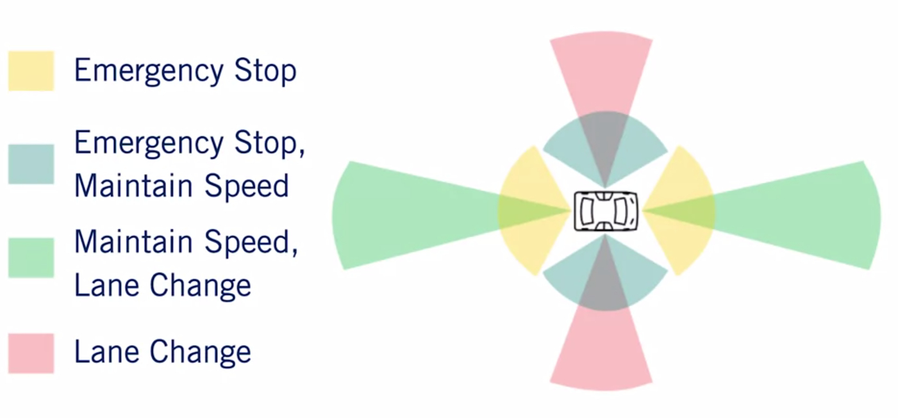

# Introduction to Self-driving Cars

## Module 1: The requirement for Autonomy

- Driving task:
  - Perceiving the environment.
  - Planning how to reach from point A to B.
  - Controlling the vehicle.
  
- Operational Design Domain (ODD)

- What makes up a driving task?
  - __Lateral control__ - steering
  - __Longitudinal control__ - braking, accelerating
  - __Object and Event Detection and Response__ (OEDR): detection, reaction
  - __Planning__:
    - Long term
    - Short term
  - Miscellaneous: signaling with indicators, hand-waving, interacting with other drivers, etc.
  
- Autonomous Capabilities
  - Automated lateral control?
  - Automated longitudinal control?
  - __OEDR__
    - Driver supervision
    - Automatic emergency response
  - Complete vs Restricted ODD
  
- __Level 0 - No Automation__: Regular vehicles, no automation
- __Level 1 - Driving Assistance__: The autonomous system assist the driver by performing either lateral or longitudinal control tasks (Adaptive cruise control).
- __Level 2 - Partial Driving Automation__: The system perform both the control tasks, both lateral and longitudinal control (e.g, GM Super Cruise, Nissan ProPilot Assist)
- __Level 3 - Conditional Driving Automation__: The system can perform Object and Event Detection in Response to a certain degree in addition to the control tasks. However, in the case of failure the control must be taken up by the driver. The key difference between level two and three, is that the driver does not need to pay attention in certain specific situation as the vehicle can alert the driver in time to intervene.
- __Level 4 - High Driving Automation__: Handle s emergencies autonomously, driver can entirely focus on other task. Level 4 system can handle emergencies on their own but may still ask driver to take over. With this system, the passenger can check their phone or watch a movie knowing that the system is able to handle emergencies. However, level four still permits self-diving systems with a limited ODD.
- __Level 5 - Fully Autonomous__: The system is fully autonomous and its ODD is unlimited. Meaning it can operate under any condition necessary.

- Limitation of this taxonomy: ODD and safety record are more important.

- __What is perception?__:
  - We want to make sense the environment and ourselves
  - Two things:
    - identification
    - understanding motion
  - Why?
    - to inform our driving decisions
    
- __Goals for perception__:
  - Statics objects: Road and lane markings; curbs; traffic lights; road signs; construction signs, obstructions, and more.
  - Dynamic object (on road)
    - Vehicle
      - 4 wheelers (cars, truck..)
      - 2 wheelers (motorbike, bicycles...)
    - Pedestrians
  - Ego localization
    - Position
    - Velocity, acceleration
    - Orientation, angular motion
  
- __Challenges to perception__
  - Robust detection and segmentation
  - Sensor uncertainty
  - Occlusion, reflection.
  - Illumination, lens flare
  - Weather, precipitation

- __Planning__
  - Making decisions
    - Long term
      - How to navigate from NY to LA?
    - Short term
      - Can I change my lane now?
      - Can I pass this intersection?
    - Immediate
      - Can I stay on track on this curved road?
      - Accelerate or brake, by how much?

- __Rule Based Planning__:
  - What we just mentioned was rule based planning (involved decision tree) 
  - In reactive rule based planning, we have rules that take into account the current state of ego vehicle and other objects and give decision.
  - Example:
    - If there is a pedestrian on the road, stop.
    - If speed limit changes, adjust speed to match it.
    
- __Predictive Planning__:
  - Make predictions about other vehicles and how they are moving. Then use these predictions to inform our decisions.
  - Example: 
    - That car has been stopped for the last 10 seconds. It is going to be stopped for the next few seconds. 
    - Pedestrian is jaywalking.She will enter our lane by time we reach her.
  - => Rely heavily on predicting information.

## Sensors and Computing Hardware
_ __Sensor___:
  - __Sensor__: device that measures or detects a property of the environment, or change to a property
  - __Categorization__:
    - Exteroceptive : surroundings
    - Proprioceptive: internal
  - __Sensors for perception:__
    - __Camera__:
      - Essential for correctly perceiving environment
      - Comparison metrics:
        - Resolution
        - Field of view
        - Dynamic range
      - Trade-off between resolution and Field of view (FOV)?
    - __Stereo camera__:
      - Enables depth estimation from image data
    - __LIDAR__:
      - Detailed 3D scene geometry from LIDAR point cloud
      - Because it is an active sensor with it's own light sources, LIDAR are not affected by the environment lightning.
      - Comparison metrics:
        - Number of beams
        - Points per second
        - Rotation rate
        - Fiew of view
      - Upcoming: Solid state LIDAR => future of affordabe autonomous driving
    - __RADAR__:
      - Robust object detection and Relative speed estimation
      - They are particularly useful in adverse weather as they are mostly unaffected by precipitation
      - Comparison metrics:
        - Range
        - FOV
        - Position and speed accuracy
      - Configurations:
        - WFOV, short range
        - NFOV, long range
    - __Ultrasonic__:
      - Sound navigation and ranging
      - Short-range all-weather distance measurement
      - Idea for low-cost parking solution
      - Unaffected by lightning, precipitation
      - Comparison metrics:
        - Range
        - FOV
        - Cost
    - __GNSS/IMU__:
      - Global Navigation Satellite System and Inertial Measurement Units
      - Direct measure of ego vehicle states
        - position, velocity (GNSS)
          - Varying accuracies: RTK, PPP, DGPS
        - angular rotation rate (IMU)
        - acceleration (IMU)
        - heading (IMU, GPS)
    - __Wheel odometry__:
      - Track wheel velocities and orientation
      - Use these to calculate overall speed and orientation of car
        - speed accuracy
        - position drift
        
    - __Highway Analysis__:
    
</img>

    
    - __Urban Analysis__:
    
</img>

    
- __Software Architecture I High-level__

</img>

- __Software Architecture Environment Perception__:

</img>

- __Software Architecture Environment Mapping__:

</img>

- __Software Architecture I Motion Planning__:

</img>

- __Software Architecture I Vehicle Controller__:

</img>

- __Software Architecture I System Supervisor__:

</img>

- __Environment Representation__:
  - __Environmental Map Types__:
    - Localization of vehicle in the environment
      - Localization point cloud or feature map
    - Collision avoidance with static objects
      - Occupancy grid map
    - Path planning
      - Detailed road map
  - __Point cloud or Feature Map (Localization Map)__:
    - Collects continuous sets of LIDAR point or images, which are combined to make  a point cloud representation of the environment
    - The difference between LIDAR maps is used to calculate the movement of the autonomous vehicle
  - __Occupancy Grid__:
    - Discretized fine grain grid map (can be 2D or 3D)
    - Occupancy by a static object (tree, buildings)
    - Curbs and other non drivable surfaces (dynamic objects are removed
  - __Detailed Roadmap__:
    - 3 Methods of creation:
      - Fully Online
      - Fully Offline
      - Created Ofline and Update Online

      
     
