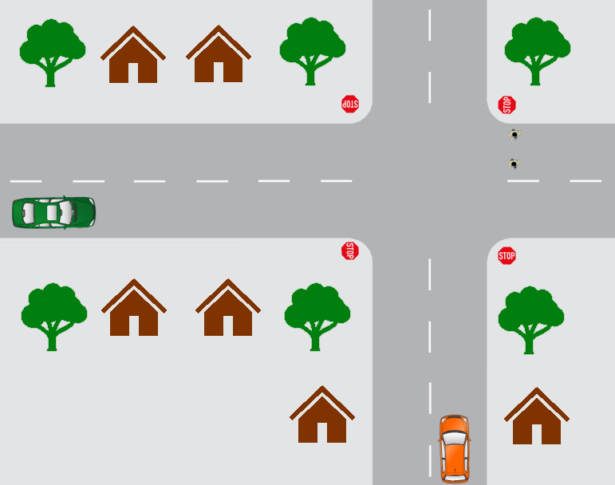
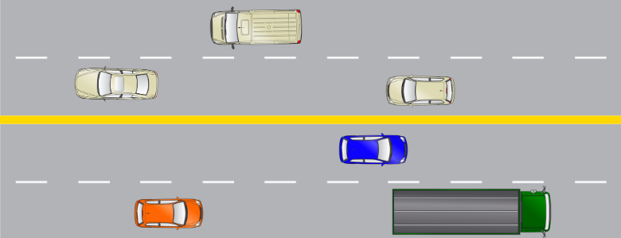
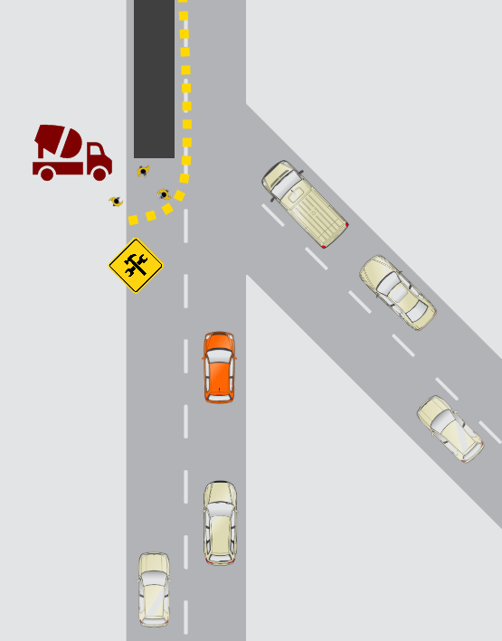
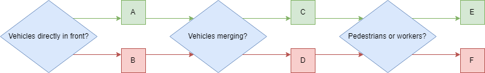

## Lesson 1: Practice Quiz
1. Which of the following are components of longitudinal control? (Select all that apply):
- [x] Accelerating
- [x] Braking
- [ ] Steering
- [ ] Planning

2. Which of the following is not an example of OEDR?

- [ ] Slowing down when seeing a construction zone ahead
- [x] Finding a route from your current location to a goal location
- [ ] Stopping at a red light
- [ ] Pulling over upon hearing sirens

2. Which of the following tasks would you expect a Level 2 system to perform?

- [ ] Swerve and slow down to avoid a pedestrian
- [x] Maintain constant speed
- [x] Change lanes
- [x] Stay within a lane

4. What is the distinction between Level 3 autonomy and Level 4 autonomy?

- [ ] Level 3 systems only have lateral or longitudinal control, Level 4 systems have both
- [ ] Level 3 systems cannot perform OEDR, Level 4 systems can
- [x] Level 3 systems require full user alertness, Level 4 systems do not
- [ ] Level 3 systems cannot drive on highways, Level 4 systems can

5. What distinguishes Level 5 Autonomy from Level 4?

- [x] Level 4 has a restricted operational design domain, whereas Level 5 is unrestricted.
- [ ] Level 5 has OEDR capability, while Level 4 does not.
- [ ] Level 5 autonomy can operate on any road surface and road type, while Level 4 cannot.
- [ ] Level 5 autonomy can operate on any weather condition, while Level 4 cannot.

## Lesson 2: Practice Quiz
1. Which of the following tasks are associated with perception? (Select all that apply)
- [ ] Planning routes on a map
- [x] Estimating the motion of other vehicles
- [x] Identifying road signs
- [ ] Responding to traffic light state changes

2. Which of the following can be on road objects? (Select all that apply)
- [ ] Stop signs
- [x] Potholes
- [x] Vehicles
- [ ] Sidewalks

3. Which of the following tasks pose challenges to perception? (Select all that apply)
- [x] Handling sensor occlusion and reflection
- [x] Having sensors work in adverse weather conditions
- [x] Handling sensor uncertainty
- [x] Detecting, tracking and predicting dynamic object motions

4. Which of the following sensors are used for ego localization? (Select all that apply)
- [x] Global Navigation Satellite System (GNSS)
- [ ] Barometers
- [ ] Radar
- [x] Inertial Measurement Unit (IMU)

5. Which of the following objects would be relevant for perception in adaptive cruise control?
- [ ] Road signs
- [ ] Lane markings
- [ ] Traffic lights
- [x] Other vehicles

## Module 1: Graded Quiz
1. Scenario 1: You’re at home and need to drive to work. During the trip, you will be performing OEDR tasks. Of the tasks below, which of the following is not an example of OEDR?
- [ ] Slowing down when seeing a construction zone ahead
- [ ] Stopping at a red light
- [ ] Pulling over upon hearing sirens
- [x] Maintaining a distance to a vehicle ahead

2. Which of the following tasks are associated with perception?
- [ ] Responding to traffic lights
- [ ] Planning routes on a map
- [x] Identifying road signs
- [x] Estimating the motion of other vehicles

3. Before leaving, you decide to check the weather. The forecast states that over the next few days there will be both sun and rain along with some fog. Assuming your vehicle exhibits Level 5 autonomy, which of the following weather conditions can your vehicle operate?
- [ ] Clear and sunny
- [ ] Windy heavy rainfall
- [ ] Heavy Fog
- [ ] Light rainfall
- [x] All of the above

4. You enter your autonomous vehicle and it drives your usual route to work. While the vehicle is driving, you decide to take a nap. For which levels of autonomy is this safe? (Select all that apply)
- [ ] 1
- [ ] 2
- [ ] 3
- [x] 4
- [x] 5

5. Scenario 2: (Assume the car is driving on the right-hand side of the road).
You’re approaching an all ways stop sign and you want to make a right turn. Your vehicle is denoted in orange. There are 2 pedestrians currently crossing and another vehicle (denoted in green) approaching the stop sign from the left.

</img>

 

This task involves multiple considerations, which of them are predictive planning? Select all that apply.
- [x] Wait for the pedestrians to finish crossing before turning
- [ ] Gradually decelerate while reaching the stop sign
- [x] The green car arrives at the stop sign after you and plans to travel straight through the intersection. You choose to move first.
- [ ] At a stop sign, stop and look both ways before proceeding

6.Here are some rules for driving at a stop sign. Which of the following is an appropriate priority ranking?

1) For non all-way stop signs, stop at a point where you can see oncoming traffic without blocking the intersection
2) If there are pedestrians crossing, stop until they have crossed
3) If you reach a stop sign before another vehicle, you should move first if safe

- [ ] 1, 2, 3
- [ ] 3, 2, 1
- [x] 2, 1, 3
- [ ] 3, 1, 2
- [ ] 1, 3, 2

7.Which of the following are off-road objects? (Select all that apply)
- [x] Stop signs
- [ ] Road markings
- [x] Curbs
- [ ] Pedestrians
- [x] Trees

8. Suppose your vehicle has lane keeping assistance, which of these objects are relevant for its performance? (Select all that apply)
- [ ] Pedestrians
- [ ] Trees
- [x] Curbs
- [ ] Stop signs
- [x] Road markings

9. Which of the following sensors are used for the lane keeping assistance? (Select all that apply)
- [ ] Barometers
- [x] GPS
- [x] LIDAR
- [x] Cameras
- [x] IMU

10. Scenario 3: You are on the highway and you see a truck in front of you. Assume the car is driving on the right-hand side of the road. There is also a blue car beside the truck in the other lane.

</img>

 

Your vehicle follows the truck and maintains a constant distance away. What kind of control is this?
- [x] Longitudinal
- [ ] OEDR
- [ ] Lateral
- [ ] Fallback

11. You decide to change lanes to pass a truck. What kind of decision is this?
- [ ] Rule-based planning
- [x] Short term planning
- [ ] Reactive
- [ ] Immediate
- [ ] Long term planning

12. Which of the following tasks are rule-based planning? (Select all that apply)
- [x] If there are vehicles directly beside us on the lane, it is unsafe to lane change.
- [ ] If the vehicle in front is going to slow down sharply, then avoid performing a lane change.
- [x] During a lane change, maintain our current speed or accelerate slightly

13. Suppose the blue vehicle suddenly brakes and you decide to abort the lane change. If your vehicle can respond automatically and remain in its own lane, what is the minimum level of autonomy of your vehicle?
- [ ] 1
- [ ] 2
- [ ] 4
- [x] 3
- [ ] 5

14. The blue vehicle returns to normal speed and you can now safely change lanes. Your car is performing the lane change, what kind of control is this?
- [ ] Longitudinal
- [ ] Fallback
- [x] Lateral
- [ ] OEDR

15. Scenario 4: You are almost at work but encounter a construction site.
Assume the car is driving on the right-hand side of the road. Your vehicle is denoted in orange.

</img>

 

You see a construction site where the workers are repaving a road full of potholes. They are using jackhammers which can cause dust clouds.

You create the following decision tree for getting through the construction site. From the diagram, which of the following decisions should you make? (green is true, red is false)

</img>

 

- [ ] A (True)
- [x] B (False)
- [x] C (True)
- [ ] D (False)
- [x] E (True)
- [ ] F (False)

16. Here are a set of rules for making these decisions, arrange them in an appropriate prioritization.

1) If there are no vehicles ahead, accelerate to the speed limit
2) Drive slowly in construction zones
3) If there are pedestrians or workers directly ahead in the current lane, stop
4) Yield to merging vehicles, if necessary

- [ ] 1, 2, 3, 4
- [ ] 2, 3, 4, 1
- [ ] 3, 4, 1, 2
- [x] 3, 4, 2, 1

17.Question 17
Scenario 5: You’re finished work and need to drive back home, but it’s nighttime.
You plan a new path home on your GPS application to avoid the construction site, what type of planning is this?

- [ ] Rule based planning
- [ ] Reactive
- [ ] Immediate
- [x] Long term planning
- [ ] Short term planning

18. Your new path goes through a school zone and you see the school zone sign. You decide to slow down despite there being no pedestrians or children (it’s nighttime). What sort of planning is this?
- [ ] Immediate planning
- [x] Rule based planning
- [ ] Long term planning
- [ ] Short term planning
- [ ] Reactive planning
