## Module 5: Graded Quiz
1. What is the order of the following transfer function?
<p align="center">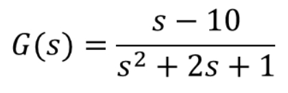</img></p>

- [ ] This is the first order transfer function
- [x] This is the second order transfer function
- [ ] This is the third order transfer function
- [ ] This is the fifth order transfer function
- [ ] None of the above

```
Correct
Correct! This transfer function contains a first order numerator and a second order denominator. The order of the function is the highest exponent in the transfer function, so that this is the second order transfer function.
```

<br><br>
2. What are the poles and zeros of the following transfer function?
<p align="center">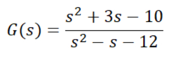</img></p>

- [x] The poles are -3 and 4; the zeros are 2 and -5
- [ ] The poles are -4 and 3; the zeros are 5 and -2
- [ ] The poles are 2 and -5; the zeros are -3 and 4
- [ ] The poles are 5 and -2; the zeros are -4 and 3
- [ ] None of the above

```
Correct
Correct! The zeros of a system are the roots of the numerator, and the poles of a system are the roots of its denominator.
```

<br><br>
3. What might be your action as a system control engineer if you need to increase the overshoot of a control loop system? (Select all that apply)

- [ ] Decrease K_D
- [ ] Decrease K_I
- [ ] Increase K_D
- [x] Increase K_P
- [ ] Decrease K_P
- [x] Increase K_I

<br><br>
4. Recall the Mass-Spring-Damper System example form the video on PID Control. This system is shown in the figure below.
As a system control engineer, you constructed the following closed loop transfer function to represent the Mass-Spring-Damper System. What is the correct transfer function for this closed loop?

<p align="center">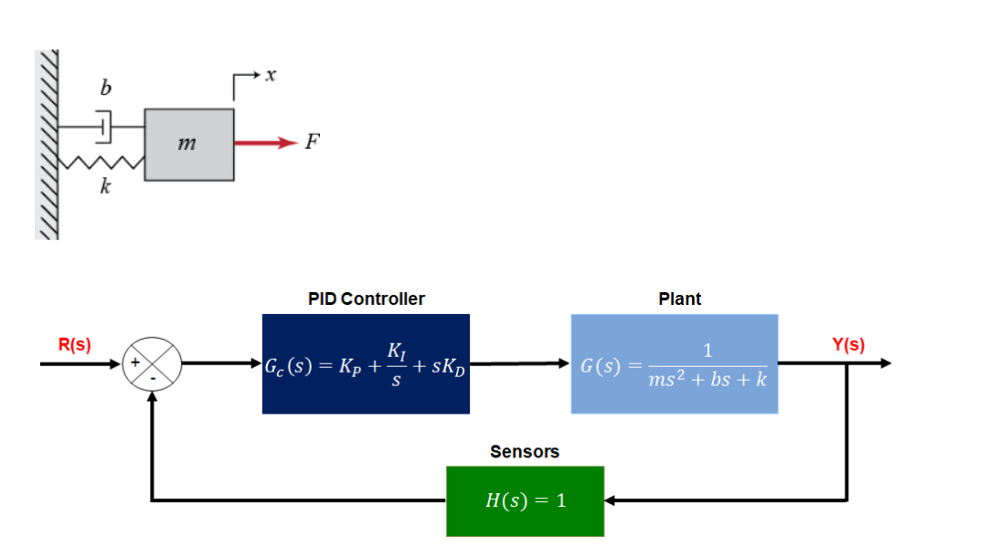</img></p> 

- [ ] Transformation function 1
  <p align="center">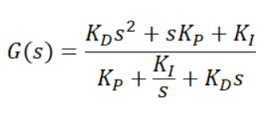</img></p> 
- [ ] Transformation function 2
  <p align="center">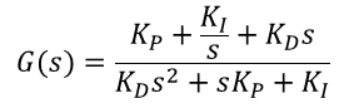</img></p> 
- [ ] Transformation function 3
  <p align="center">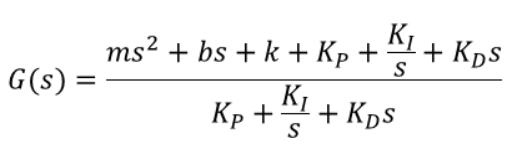</img></p> 
- [x] Transformation function 4 
  <p align="center">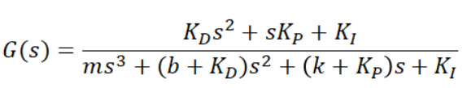</img></p> 
- [ ] None of the above

<br><br>
5. You are given the step response of a few different PID controllers using the same gains for the same first order transfer function. Determine a possible set of controllers that generated these step responses:
<p align="center">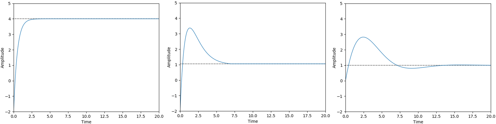</img></p>

- [ ] 1st response by PI; 2nd response by PD; 3rd response by PID
- [ ] 1st response by PD; 2nd response by PI; 3rd response by PID
- [ ] 1st response by PI; 2nd response by PID; 3rd response by PD
- [x] 1st response by PD; 2nd response by PID; 3rd response by PI
- [ ] None of the above

```
Correct
Correct! Adding derivative control improves the step response in terms of overshoot and settling time, but slows down the rise time. Adding the integral term instead maintains a short rise time, and is able to reduce oscillation and overshoot, leading to a fast settling time as well. Adding both derivative and integral control terms brings the advantages of both these approaches.
```

<br><br>
6. What is the output of a typical output of a Longitudinal control module? (Select all that apply)

- [ ] Reference velocity
- [x] Throttle angle
- [ ] Steering angle
- [x] Brake position

<br><br>
7. Based on the engine map in the figure below, determine the throttle angle needed to produce 250 ft-lb of torque given that the current engine speed is 3500 RPM.
<p align="center"></img></p> 

- __60__

<br><br>
8. The results of a simulation of the control response to a step change in desired speed of a dynamic vehicle model with a PID controller are shown in the figures below. There are two spikes on these figures: one spike is between 2 and 3 seconds, another spike is between 3 and 4 seconds. What is the reason of these spikes?

<p align="center">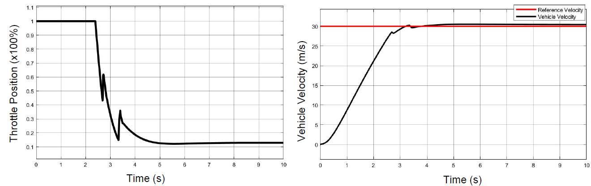</img></p>

- [ ] Engine-transmission torque loss
- [ ] Tire slip
- [x] Nonlinear engine map
- [ ] High level controller simplification: changing the integral to a summation over fixed length time steps in the Integral term
- [ ] None of the above

```
Correct
Correct! These artefacts are caused by the engine map nonlinearities.
```

<br><br>
9. What type of control system is shown in the figure below?
<p align="center">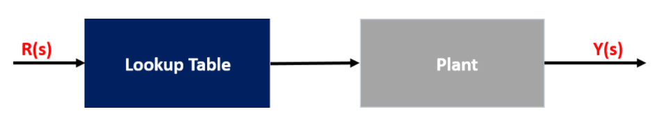</img></p>

- [ ] Feedback control
- [x] Feedforward control
- [ ] Feedback-feedforward control
- [ ] None of the above

```
Correct
Correct! This diagram represents a feedforward controller. It show an open loop structure, where the reference signal is directly fed into the feedforward controller, which generates the inputs to the plant.
```

<br><br>
10. What types of inaccuracies are corrected by a feedback controller?

- [x] Disturbances
- [ ] Nonlinear engine map
- [x] Errors in the plant model
- [ ] High level controller simplification: changing the integral to a summation over fixed length time steps in the Integral term

<br><br>
11. What assumptions are essential for creation of a longitudinal feedforward input? (Select all that apply)

- [ ] The tire slip angle and ratio are negligible
- [ ] The plant system is linear
- [ ] Torque from the engine passes directly to the transmission without loss
- [x] The vehicle is at steady state

```
Correct
Correct! Modelling feedforward block requires converting the entire longitudinal dynamics model into a fixed lookup table or reference map, that maps the reference velocity to the corresponding actuator signals assuming the vehicle is at steady state.
```

<br><br>
12. What are the sources of the load torque considered for a longitudinal feedforward look-up table computation? (Select all that apply)

- [x] Gravitational resistance
- [x] Rolling resistance
- [ ] Static friction
- [ ] Sliding resistance
- [x] Aerodynamic resistance
- [ ] Cornering force

<br><br>
13. A vehicle is being operated on a highway with the reference velocity of 126 km/h (35 m/s) in gear 4 and it overcomes the total load torque of 300 ft-lb. This vehicle specification includes effective wheel radius of 0.35 m and 4th gear ratio of 2. What throttle angle is required for maintaining the the current speed of the vehicle?
Please use the below engine map for your computation.

<p align="center">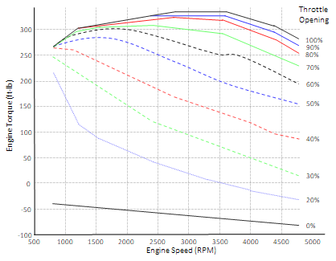</img></p>

- __70__

<p align="center">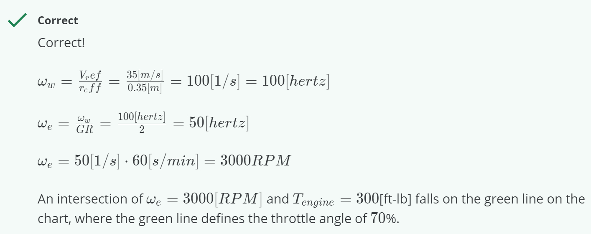</img></p>
