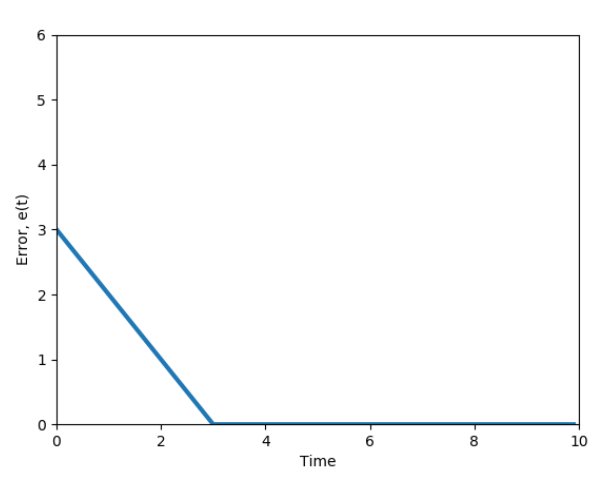
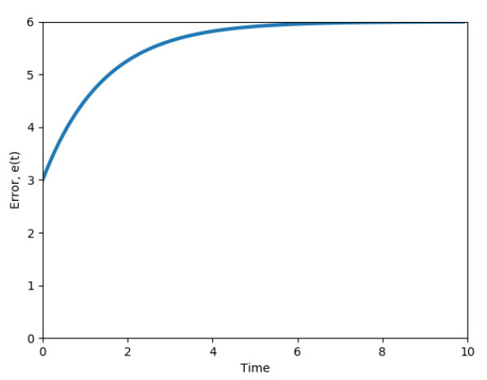
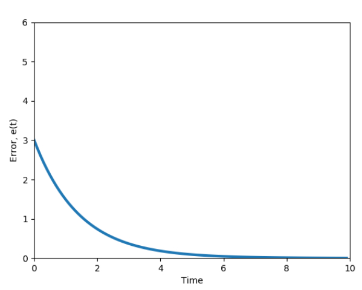
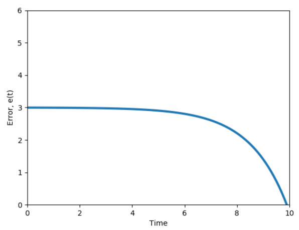
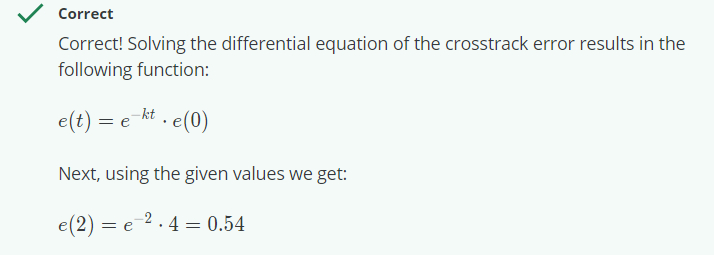

## Module 6: Graded Quiz

1. Which reference path is the most compact and easy to construct?

- [x] Track straight line segment
- [ ] Track waypoints
- [ ] Track parameterized curves
- [ ] None of the above

```
Correct! The easiest approach is to define a sequence of straight line segments, by requiring a sequence of endpoint vertices that are connected linearly. This path definition can be very compact and easy to construct, assuming points are well spaced and the environment allows for mostly straight line motion.
```

<br><br>
2. What is the most ACCURATE and PRECISE definition of the crosstrack error?

- [ ] The crosstrack error is the difference between path heading and the vehicle heading at a reference point along the path

- [x] The crosstrack error is the distance between the vehicle reference point and the closest point on the reference path

- [ ] The crosstrack error is the sum of the absolute difference between each coordinate of the vehicle reference point and the corresponding closest point on the desired path

- [ ] None of the above

```
Correct! It is the principle measure of how close the vehicle’s position is to the desired position along the path.
```

<br><br>
3. What vehicle reference frame is used in a pure pursuit controller?

- [ ] Center of gravity
- [ ] Center of the front axle
- [x] Center of the rear axle
- [ ] None of the above

```
Correct! In this method, the centre of the rear axle is used as the vehicle reference frame. Also, recall that we define the line that connects the centre of the rear axle to the target reference point as the lookahead distance.
```

<br><br>
4. Compute the radius from the instantaneous center of rotation to the center of the vehicle rear axle (in m) required for an autonomous vehicle to follow the desired path based on the information below.

The lookahead distance is 10 m; the car length is 4 m; the angle between the vehicle’s body heading and the lookahead line is 30°. Your answer should be an integer.

- __10__

<br><br>
5. Compute the steering angle (in degrees) required for an autonomous vehicle with pure pursuit lateral control for following the desired path based on the information below.

The lookahead distance is 15 m; the car length is 5 m; the angle between the vehicle’s body heading and the lookahead line is 60°.

If you need help formatting math functions, read this article.

- __30__

<br><br>
6. Consider a situation in which a vehicle traveling speed has decreased from 100 km/h to 50 km/h. This vehicle lateral control is implemented with a pure pursuit controller where l_d is assigned as a function of vehicle speed. How should l_d change in this situation?
​	
- [ ] l_d should increase
- [x] l_d should decrease
- [ ] l_d should stay the same
- [ ] l_d can increase or decrease depending on how the controller is tuned
- [ ] None of the above

```
Correct! The pursuit controller with a fixed value of ld does not take into account the vehicle speed. This means that the selected steering angle would be the same regardless of whether the vehicle is going 10 km/h or 100 km/h, leading to very different lateral accelerations. A controller tuned for high speed would be far to sluggish at low speed, and one tuned for low speed would be dangerously aggressive at high speed. To overcome this limitation, we define the lookahead distance to increase proportional to vehicle forward speed.
```

<br><br>
7. What are major components of the Stanley controller? (Select all that apply)

- [x] Proportional control is introduced for minimizing the crosstrack error

- [x] Steering angle command is restricted to the min and max steering angles

- [ ] Crosstrack error is eliminated

- [ ] Derivative control is introduced for minimizing the heading error

- [ ] Integral control is added for both the heading and the crosstrack errors optimization

- [x] Steering angle is set equal to the heading direction to eliminate heading error relative to the path

<br><br>
8. What is the correct figure of the crosstrack error dynamics for a small error value (where e'(t)= -ke(t)?

- [ ] Figure 1:
  <p align="center"></img></p>

- [ ] Figure 4:
  <p align="center"></img></p>


- [x] Figure 3:
  <p align="center"></img></p>

- [ ] Figure 2:
  <p align="center"></img></p>

<br><br>
9. What is the value of the crosstrack error, governed by the ODE e'(t) = -ke(t), at t = 2 given that e(0) = 4 and k = 1?
Please give your answer with the precision of 2 decimal places.

- __0.54__ 
  <p align="center"></img></p>

<br><br>
10. Which of the statements below about Model Predictive Control (MPC) are TRUE? (Select all that apply)

- [x] MPC can impose constraints on the states and the input simultaneously
- [ ] MPC is an optimized version of Receding Horizon Control
- [x] The formulation of an MPC controller is straightforward
- [x] MPC works for both linear and nonlinear models

<br><br>
11. What is the typical way of finding the solution for a nonlinear vehicle dynamics model given an input function?

- [ ] Laplace transform
- [x] Numerical optimization
- [ ] Using existing closed form solution
- [ ] None of the above

<br><br>
12. What is the output of the Model Predictive Controller described in this course? (Select all that apply)

- [ ] Throttling/braking
- [ ] Steering angle
- [x] Longitudinal forces
- [x] Lateral forces
- [ ] None of the above
