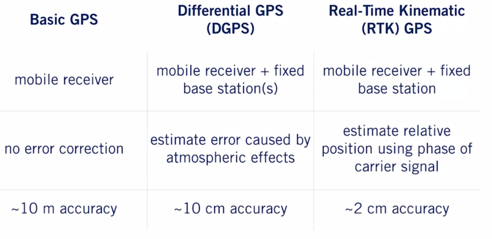

# State Estimation and Localization for Self-Driving Cars

## Module 1: Least Squares
This method of least squares, developed by Carl Friedrich gauss in 1795, is a well known technique for estimating parameter values from data. This module provides a review of least squares, for the case of unweighted observation. There is a deep connection between least squares and maximum likelihood estimator (when the observation are considered to be Gaussian random variables) and this connection is established and explained. Finally, the module develops a technique to transform the traditional "batch" least squares estimator a recursive form, suitable for online, real-time estimation application. 

### Squared Error Criterion and the Method of Least Square

_The most probable value of the unknown quantities will be that in which the sum of the square of the difference between the actually observed and the computed values multiplied by number that measure the degree of precision in a minimum.__ - Carl Friedrich Gauss

- __Assumptions__:
  - Our measurement model, y=x+v is linear
  - Measurement are equally weighted (we do not suspect that some have more noise than others)

  
</img>

-  __Summary__:
  - Measurement can come from sensors that have different noisy characteristics.
  - Weighted least squares let us weight each measurement according to noise variance. 

### Recursive Least Square
We've already explored the problem of computing value for some unknown but constant parameter from a set of measurement- One of our assumptions was that we had all of the data at hand. That it, we assumed that we collected a batch of measurements and we wanted to use those measurement to compute our estimated quantities of interest. 

What can we do if we have a stream of data? For example, let's say we have a multimeter that can measure resistance 10 times per second. Ideally we'd like to use as many measurements as possible to get an accurate estimate of the resistance. If we use the method of least square however, the amount of computational resources we will need to solve our normal equations will grow with the measurement vector size. 

Alternatively, we can try and use a recursive method one that keeps a running estimate of the optimal parameter for all of the measurement that we've collected up to the previous time step and then updates that estimate given the measurement at the current time step. To do this we use a recursive algorithm, incrementally updating our estimate as we go along.

- __Recursive Recursive Estimator__:
  
</img>

  
- __Summary__:
  - RLS produces a "running estimate" of parameters(s) for a stream of measurement.
  - RLS is a linear recursive estimator that minimizes the covariance of the parameter(s) at the current time.
  
### Least Squares and Maximum Likelihood

</img>

- __The Central Limit Theorem__
  - In realistic systems like self-driving cars, there are many resources of "noise"
  - _Central Limit Theorem: When independent random variables are added, their normalized sum tends towards a normal distribution_
  - Why use method of least squares?
    1. Central Limit Theorem: sum of different errors will tend be "Gaussian"
    2. Least squares is equivalent to maximum likelihood under Gaussian noise

- __Least Squares | Some Caveats__
  - Poor measurement (e.g. outliers) have significant effect on the method of least square
  - It's important to check that the measurement roughly follow a Gaussian distribution
  - Outliers might result from people walking in the middle of a LIDAR scan, or from a bad GPS signal. 

- __Summary__:
  - LS as WLS produce the same estimate as maximum likelihood assuming Gaussian noise
  - Central Limit Theorem states that complex error will tend towards a Gaussian distribution.
  - Least squares estimates are significantly affected by outliers.

## Module 2: The Kalman Filter (Linear and Non-linear)
We can think of the Kalman filter as a technique to fuse information from different sensors to produce a final estimate of some unknown state, taking into account, uncertainty in motion and in our measurement. 

</img>

- __Recursive Least Square + Process Model__:

</img>

</img>

- __The Kalman Filter and the Bias BLUES__
  - We say an estimator or filter is *unbiased* if it produces an "average" error of zero at a particular time step k, over many trials. 
  - The Kalman Filter is the Best Linear Unbiased Estimator (BLUE)
  - We've shown that given our linear formulation, and zero-mean, white noise the Kalman FIlter is unbiased
  - In general, if we have white, uncorrelated zero-mean noise, the Kalman filter is the best (i.e., lowest variance) unbiased estimator that used only a linear combination of measurement.

- __Going non-linear - the Extended Kalman Filter (EKF)__
  - Computing the Jacobian matrices
    - In vector calculus, a Jacobian matrix is the matrix of all first-order partial derivatives of a vector-values function.
    - Intuitively, the Jacobian matrix tells you how fast each output of the function is changing along each input dimension.
    
</img>

    
- __Summaray__
  - The EKF use linearization to adapt the Kalman filter to nonlinear system
  - Linearization works by computing local linear approximation to a nonlinear function about a chosen operating point
  - Linearization relies on computing Jacobian matrices, which contain all the first-order partial derivatives of a function.
  
- __An Improved EKF - The Error State Extended Kalman Filter__
  - We can think of the vehicle state as composed of two parts: Nominal state and Error State
    - We can continuously update the nominal state by integrating the motion model.
    - Modeling error can process noise accumulate into the error state
    
</img>

    
  - In the erro state EKF, instead of doing Kalman filtering on the full state which might have lots of complicated non-linear behaviors, we're going to use the EKF to estimate the error state instead, and then use the estimate of the error state as a correction to the nominal state. 

  - Why use the ES-EKF?
    1. Better performance compared to vanila EKF: The small error is more amenable to linear filtering than the large nominal state, which can be integrated nonlinearly.
    2. Easy to work with constrained quantities (e.g., rotation in 3D)
    
- __Limitation of EKF__
  - The EKF works by linearizing the nonlinear motion and measurement models to update the mean and covariance of the state.
  - The difference between the linear approximation and the nonlinear function is called linearization error
  - In general, linearization depends on:
    1. How nonlinear the function is: If our nonlinear function very slowly or is quite flat much of the time, linear approximation is going to be a pretty good fit. On the other hand, if the function varies quickly, linear approximation is not going to do a great job of capturing the true shape of the function over most of its domain.
    2. How far away from the operating point the linear approximation is being used: The further away you move from the operating point, the more likely the linear approximation is to diverge from the true function.
    
  - The EKF is prone to linearization error when:
    1. The system dynamics are highly nonlinear
    2. The sensor sampling time is slow relative how fast the system is evolving. (e.g., for self-driving car moving very fast relative to the sampling time of your sensors, you're going to get more linearization error than if it's moving slowly  ) 
  
  - This has two important consequences:
    1. The estimated mean state can become very different from the true state
    2. The estimated state covariance can fail to capture the true uncertainty in the state. 
    __Linearization error can cause the estimator to be overconfident in a wrong answer__
    Once a estimator such as the EKF has diverged, it can't be pulled back on track. Often, you're forced to re-initialized if you can.
    3. Computing Jacobian matrices for complicate nonlinear functions is also a common source of error in EKF implementation!
      - Analytical differentiation is prone to human error.
      - Numerical differentiation can be slow and unstable.
      - Automatic differentiation can also behave unpredictably.

- __An alternative to the EKF - The Unscented Kalman Filter (UKF)__
*It is easier to approximate a probability distribution than it is to approximate an arbitrary nonlinear function*

- The UKF uses the unscented transform to adapt the Kalman Filter to nonlinear system. 
- The unscented transform works by passing a small set of carefully chosen samples through a nonlinear system, and computing the mean and covariance of the output. 
- The unscented transform does a better job of approximating the output distribution than analytical local linearization, for similar computational cost

## Module 3: GNSS/INS Sensing for Pose Estimation
To navigate reliably, autonomous vehicle requires an estimate of their pose (position and orientation) in the world (and on the road) at all times. Much like for modern aircraft, this information can be derived from a combinations of GPS measurement and inertial navigation system (INS) data. This module introduces sensor models for inertial measurement units and GPS (and, more broadly, GNSS - Global Navigation Satellite Systems) receivers; performance and noise characteristic are reviewed. The module describes ways in which the two sensor systems can be used in combination to provide accurate and robust vehicle pose estimates. 

- __3D Geometry and Reference Frames__
  - **How to represent a rotation: Rotation matrix, unit quaternions, Euler angles**.
  
  - **Which rotation representation should I use?**
  
</img>

- **The Inertial Measurement Unit (IMU)**
  - An IMU is typically composed of 
    - Gyroscopes (measure angular rotation about three separate axes)
    - Accelerometers (measure accelerations along three orthogonal axes)
    
- **The Gyroscope**:
  - Historically: a spinning disc that maintains a specific orientation relative to inertial space, providing an orientation reference. 
  - Modern spinning-disk gyroscopes spin at up to 24,000 RPM!
  - Microelectromechanical systems (MEMS) are much smaller and cheaper
    - Measure rotational rates instead of orientation directly. 
    - Measurement are noisy and drift overtime

- **The Accelerometer**
  - Accelerometer measure acceleration relative to free-fall - this is so called the proper acceleration or specific force. 
  - In localization, we typically require the acceleration relative to a fixed reference frame.
  
- **The Global Navigation Satellite System (GNSS)**
  - **GPS - Global Positioning System**
    - Composed of 24-32 satellite sin 6 orbital planes
    - Attitude of ~20,200 km
    - Orbital period of 12 hours
    - Each GPS satellite transmits a signal that encode:
      1. Its position (via accurate ephemeris information)
      2. Time of signal transmission (via onboard atomic clock)
    - To compute a GPS position fix in the Earth-centred frame, the receiver uses the speed of light to compute distances to each satellite based on time of signal arrival. 
    - At least four satellites are require to solve for 3D position, three if only 2D is required 
    
  - **Trilateration**
  
</img>

  
  - **GPS error**
    - Error Sources: Ionospheric delay: Charged ions in the atmosphere affect signal propagation
    - Multipath effects: Surrounding terrain, building can cause unwanted reflections. 
    - Ephemerics & clock errors: A clock error of 1x10^-6s gives a 300m position error!
    - Geometric Dilution of Precision (GDOP): The configuration of the visible satellites affects potions precision
    
  - **GPS improvement**
  
</img>
  

## Module 4: LIDAR Sensing
LIDAR (light detection and ranging) sensing is an enabling technology for self-driving vehicles. LIDAR sensors can see farther than cameras and are able to provide accurate range information. This module develops a basic LIDAR sensor model an explores how LIDAR data can be used to produce point clouds (collections of 3D points in a specific reference frame). Learners will examine ways in which two LIDAR point clouds can be registered, or aligned, in order to determine how the pose of the vehicle has changed with time (i.e, the transformation between two local reference frames),

- **Measurement Models for 3D LIDAR Senson**
  - 3D LIDAR sensors report range, azimuth angle and elevation angle
  
</img>

- **Source of Measurement Noise**
  - Uncertainty in determining the exact time of arrival of the reflected signal
  - Uncertainty in measuring the exact orientation of the mirror
  - Interaction with the target (surface absorption, specular reflection, etc..)
  - Variation of propagation speed (e.g, through materials)
  - **Can't rely on LIDAR alone to detect and avoid obstacles**
  
- **Motion Distortion**
  - Typical scan rate for a 3D LIDAR is 5-20Hz.
  - For a moving vehicle, each point in a scan is taken from a slightly different place.
  - Need to account for this if the vehicle is moving quickly, otherwise motion distortion becomes a problem.

- **LIDAR Point Clouds**
  - One common solution to store point clouds data is to assign an index to each of the points, say point 1 through point n, and store the x,y and z coordinates of each point as a 3 by 1 column vector. From there, you could think about storing each of these vectors in a list, or stack them side by side into a matrix called big P. 
  
</img>

   
  
- **Operation on point clouds** 
  - **Translation**:
  
</img>

   
  
  - **Rotation**:
  
</img>

   
  
  - **Scaling**:
  
</img>

   
  
  - **Putting Them All Together**:
  
</img>

     
  
- **The Point Cloud Library (PCL)**
  - Open-source Point CLoud Library (PCL)
  - Widely used in industry
  - Unofficial Python binding exist
  
- **State Estimation via Point Set Registration**
  - The point set registration problems says, given 2 point clouds in two different coordinate frames, and with the knowledge that they correspond to or contain the same object in the world, how shall we align them to determine how the sensor must have moved between the two scans?
  More specifically we want to figure out the optimal translation and optimal rotation between the two sensor reference frames that minimizes the distance between the 2 point clouds. 
  
</img>

     
  
  
  - Assuming we know which points corresponding to which, we can find the translation and rotation that lines up each point with its twin. In the example above, our idea rotation matrix would be the identity matrix (no rotation) while the idea translation matrix would be along the cars forward direction.
  
  - *The problem is that: We don't know which points corresponds to which?*
  
- **The Iterative Closet Point (ICP) Algorithm**
  - __Intuition__: When the optimal motion is found, corresponding points will be closer to each other than to other points. 
  - __Heuristic__: For each point, the best candidate for a corresponding point is the point that is closet to it right now. The idea is that this heuristic should give us the correspondences that let us make our next guess for the translation and rotation, that's a little bit better than our current guess. As our guesses get better and better, our correspondences should also get better and better until we eventually converge to the optimal motion and the optimal correspondences. This iterative optimization scheme using the closest point heuristic is where ICP gets its name.
  
- **ICP algorithm**

</img>
   

</img>
   

</img>
 

</img>
 

- **ICP Variants**
  - Point-to-plane ICP 
