## Module 1: Basics of 3D Computer Vision
This module introduce the main concepts from the broad field of computer vision need to progress through perception methods for self-driving vehicles. The main components include camera models and their calibration, monocular and stereo vision, projective geometry, and covolution operations.
- **Camera Projective Geometry**

  3D points in the world coordinate frame can be projected to 2D points in the image coordinate frame using projective geometry equations.
  
  - **Projection from World coordinates to Image coordinates**:
    1. Projection from World coordinates to Camera coordinates.
    2. Project from Camera coordinates to Image coordinates.
    
    
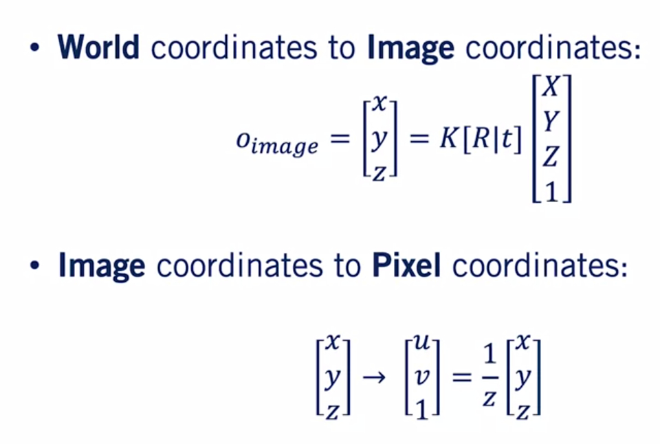</img>
 

- **Camera calibration**
  
  - Use scenes with **known geometry** (e.g., checkerboard) to:
    - Correspond 2D image coordinates to 3D world coordinates
    - Find the **Least Squares Solution** (or non-linear solution) of the parameters of P
    - If we have N 3D points and their corresponding N 2D projects, set up homogeneous linear system.
    - Solve with Singular Value Decomposition (SVD) to get the least square solution
    - **Advantages**:
      - Easy to formulate.
      - Closed form solution.
      - Often provides really good initial points for nonlinear calibration approaches.
      
    - **Disadvantages**:
      - Does not directly provide camera parameters
      - Does not model radial distortion and other complex phenomena.
      - Does not allow for constraints such as known focal length to be imposed

- **Visual Depth Perception - Stereopsis**
  - Assumption:
    - Sensor is constructed from two identical cameras
    - The two cameras have parallel optical axes
    
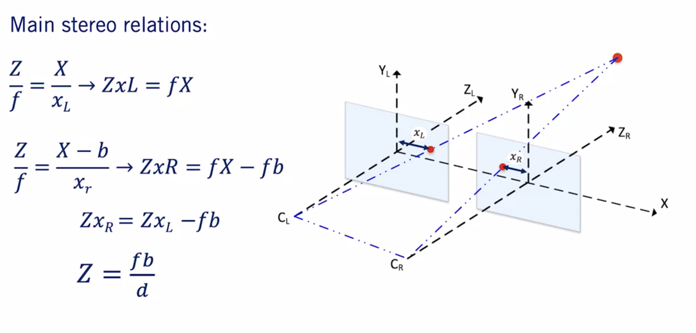</img>
 
    
  
  - **Disparity**: the difference in image location of the same 3D point under perspective to two different cameras. 
    - To compute disparity, we need to be able to find the same point in the left and right stereo camera images.
    - We can constrain our correspondence search to be along the epipolar line, reducing the search from 2D to 1D (assuming optical axes of the two cameras are parallel).
    - We can use stereo rectification to wrap images originating from two cameras with non-parallel optical axes to force epipolar lines to be horizontal.
    
    
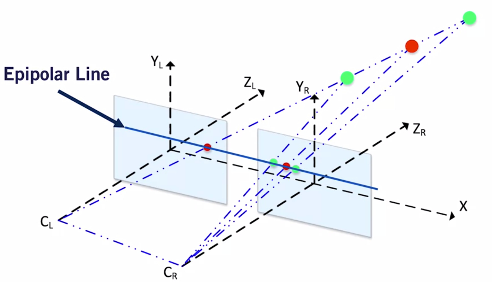</img>
 
  
  - **A Basic Stereo Algorithm**
    - Given: Rectified Images and Stereo Calibration. For each epipolar line:
      1. Take a pixel on this line in the left image
      2. Compare these left image pixels to every pixel in the right image on the same epipolar line.
      3. Pick the pixel that has minimum cost.
      4. Compute disparity d by subtracting right pixel location from the left one
  
- **Image Filtering**  
    - **Convolution**: is a cross-correlation where the filter is flipped both horizontally and vertically before being applied to the image. 
    - **Template Matching**: is a problem where we are given a pattern or a template, and we want to find its location in the image. The pixel with the **highest response** from Cross-correlation is the location of the template in an image. 
    
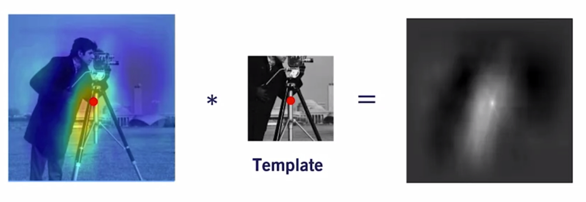</img>
 
    
    - **Gradient Computation**
      - Conolution can be used for Image gradient comyou
      putation
      - Image gradients are extremely useful for detection of edges and corners.
      - Define a finite difference kernel, and apply it to the image to get the image gradient.
      
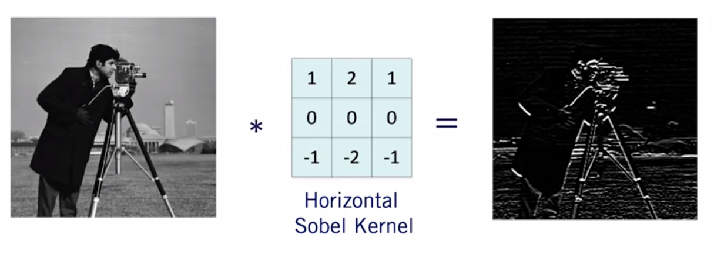</img>
 
      
## Module 2: Visual Feature - Detection, Description and Matching
Visual features are used to track motion through an environment and to recognize places in a map. this module describes how features can be detected and tracked through a sequence of images and fused with other sources for localization as described in Course 2. Features extraction is also fundamental to object detection and semantic segmentation in deep networks, and this module introduces some of the feature detection methods employed in that context as well.

- **Feature Detection**:
  - Feature are **points of interest** in an image
  
  - **Points of interest** should have following characteristics:
    1. Saliency: distinctive, identifiable, and different from its immediate neighborhood
    2. Repeatability: can be found in multiple images using same operations
    3. Locality: occupies a relatively small subset of image space
    4. Quantity: enough points represented in the image
    5. Efficiency: reasonable computation time 
    
- **Feature Extraction**:
  - Repetitive texture less patches are challenging to detect consistently.
  - Patches with large contrast changes (gradients) are easier to detect (edges).
  - Gradients in at least two (significantly) different orientations are the easiest to detect. 

- **Feature Detection: Algorithm**
  - Harris {corners}: Easy to compute, but not scale invariant (1988). 
  - Harris-Laplace {corners}: Same produce as Harris detector, addtion of scale selection based on Lapacian. Scale invariance (2001)
  - Feature from accelerated segment test (FAST) {corners}: Machine learning approach for fast cornet detection (2006).
  - Laplacian of Gaussian (LOG) detector {blob}: Use the concept of scale space in a large neighborhood (blob). Somewhat scale invariant (1998).
  - Difference of Gaussian (DOG) detector (blobs): Approximate LOG but is faster to compute (2004)
  
- **Feature Descriptors**
    - **Feature:** Point of interest in an image defined by its image pixel coordinates **[u,v]**
    - **Descriptor**: An N-dimensional vector that provides a summary of the image information around the detected feature
    
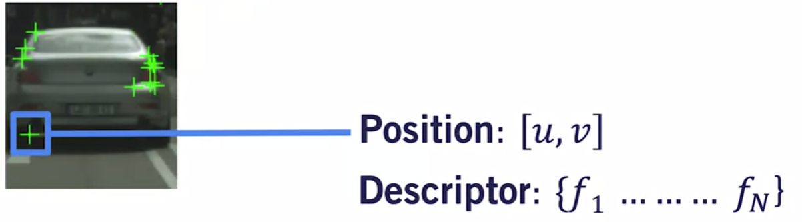</img>
 
    
    - **Feature descriptors should have the following characteristics:**
      - **Repeatability**: manifested as **robustness and invariance** to translation, rotation, scale, and illumination changes
      - **Distinctiveness**: should allow us to distinguish between two close by features, very important for matching later on
      - **Compactness & Efficiency**: reasonable computation time

- **Designing Invariant Descriptors: SIFT**
  - Scale Invariant Feature Transform (SIFT) descriptors (1999):
    1. 16 x 16 window around detected feature
    2. Separate into 4 cells, each comprised of 4 x 4 path of pixels. 
    3. Compute edge orientation of each pixel in the cell.
    4. Suppress weak edges using a predefined threshold.
    5. Construct 32 dimensional histogram of orientations for each cell, then concatenate to get 128 dimensional descriptor.
    
    
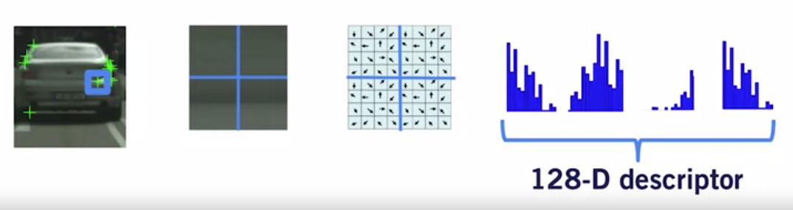</img>
 

  - The above system process is usually compute on rotated and scaled version of the 16 x 16 window, allowing for better scale robustness
  
  - Combined with the DOG feature detector, SIFT descriptors provide a scale, rotation and illumination invariant detector/descriptor pair
  
- **Feature matching**:
  - General process:
    1. Identify image features, distinctive point in our images.
    2. We associate a descriptor from each feature from its neighborhood.
    3. Use descriptors to match features across two or more images.
  
  - Brutal Force Feature Matching:
    - Define a distance function that compares the two descriptors
    
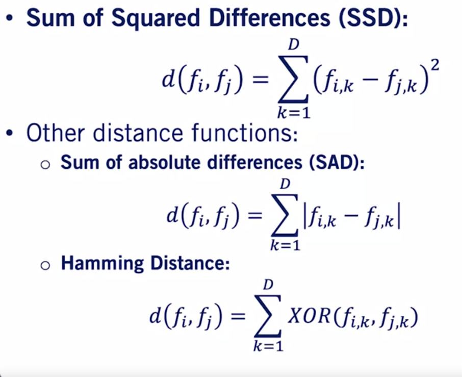</img>
 
    
    
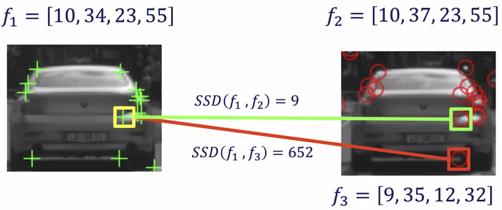</img>
 
      
  - Brutal force feature matching might not be fast enough for extremely large amounts of features

  - Ambiguous matches are features in the first image that have similar distance to two or more features in the second image. We can handle it by computing **distance ratio**, and making sure this ratio is lower than predefined threshold. 
  
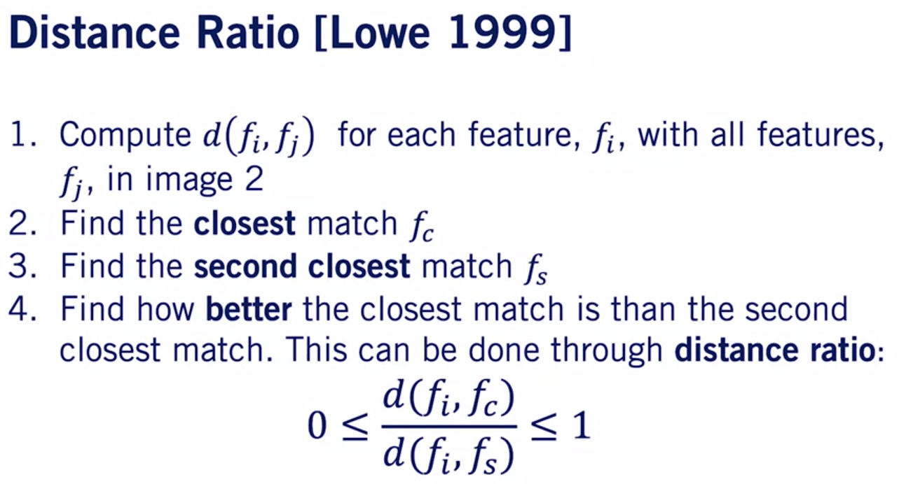</img>
 
  
- **Outlier Rejection**
  - **Image Features: Localization**
  
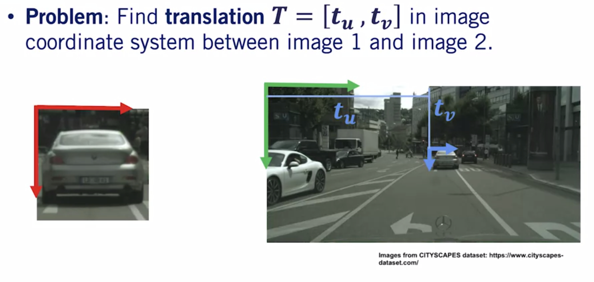</img>
 
  
  - **Ouliers** are wrong feature matching outputs, that can occur due to errors in any of the three stages of feature usage. 
  
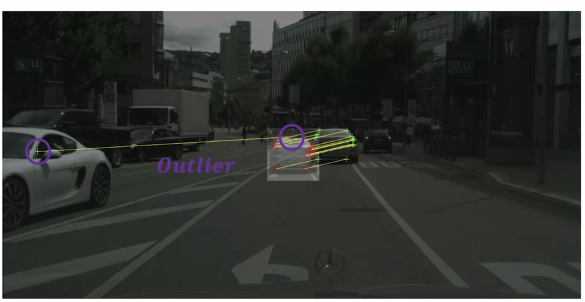</img>
 
  
    - **Random Sample Consensus (RANSAC)**: One of the most used model-based methods for outlier rejection in robotics. 
    
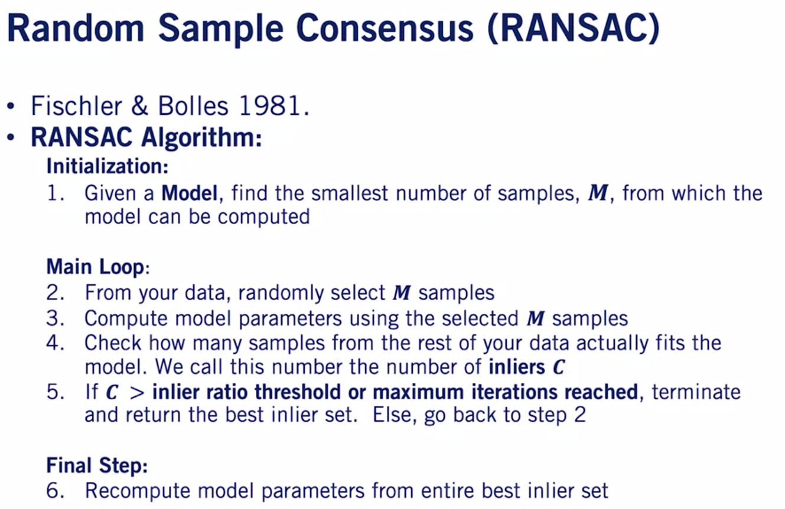</img>
 
    

- **Visual Odometry**
  - Visual Odometry (VO) is the process of incrementally estimating the pose of the vehicle by examining the changes that motion induces on the images of its onboard cameras. 
  
  - **VO Pros**: 
    - No affected by wheel slip in uneven terrain, rainy/snowy weather or other adverse conditions. 
    - More accurate trajectory estimates compared to wheel odometry.
  
  - **VO Cons**:
    - Usually need an external sensor to estimate **absolute scale**.
    - Camera is passive sensor, might not be very robust against weather conditions and illumination changes.
    - Any form of odometry (incremental state estimate) drifts over time.
    
  
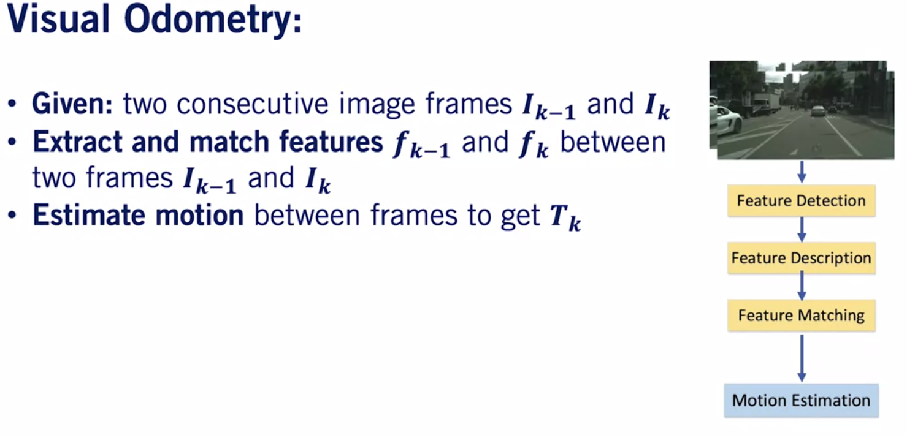</img>
 
  
  - **Motion Estimation**:
    - Visual odometry can be performed using 2D-3D feature correspondences and the Pnp algorithm.
    
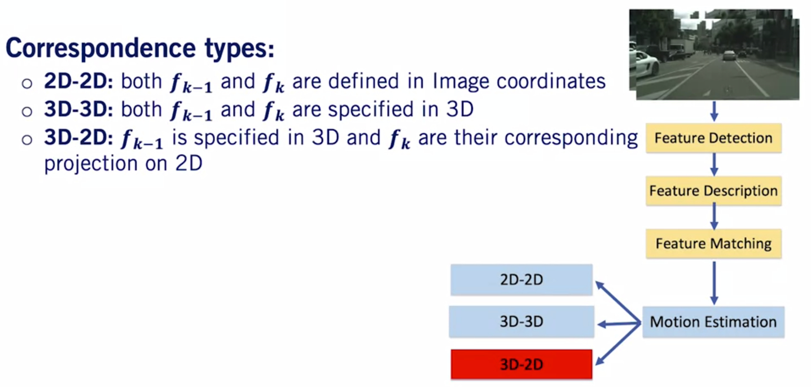</img>
 
    
  
## Module 3: Feedforward Neural Networks
Deep learning is a core enabling technology for self-driving perception. This module briefly introduces the core concepts employed in modern covolutional neural networks, with an emphasis on methods that have been proven to be effective for tasks such as object detection and semantic segmentation. Basic network architectures, common components and helpful tools for constructing and training networks are described.

- __Feedforward Neural Networks__:

  
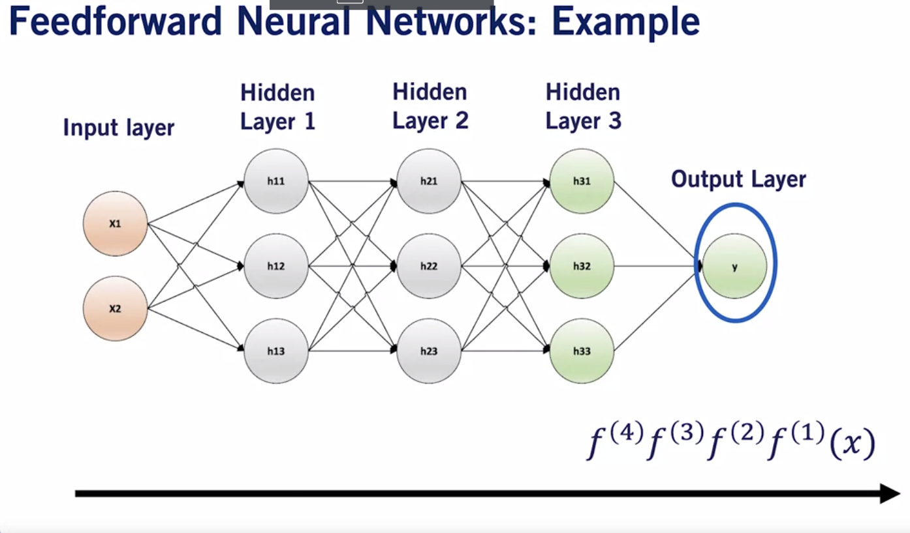</img>
   
  
  - __Function to estimate__:
    - __Object Classification__: Image -> Label
    - __Object Detection__: Image -> Label + Location
    - __Depth Estimation__: Image -> Depth for every pixel
    - __Semantic Segmentation__: Image -> Label for every pixel

  - Feedforward neural networks can be used for a variety of perception tasks related to self-driving cars
  - Feedforward neural networks rely on hidden layers to implement a good approximation of a target function. 
  - Various activation functions are available to use within hidden layers. RELU is the default baseline.

- __Output Layers and Loss Function__:
  - __Classification__: image classification, semantic segmentation
    - Softmax Output Layers are most often used as the output of a classifier, to represent the probability distribution over K different classes.
    - Cross-Entropy Loss Function
    
  - __Regression__: Depth prediction, bounding box estimation
    - Linear Output Units
    - Mean Square errors loss function to model the mean of a probability distribution

- **NN Training with Gradient Descent**:
  - Batch Gradient Descent is an iterative first order optimization procedure.
  - Parameter Initialization: Weights, Biases and other heuristics exists
  - Stochastic (minibatch) Gradient Descent:
    - GPUs work with powers of 2 batch sizes
    - __Large batch size > 256__:
      - Hardware underutilized with very small batch sizes.
      - More accurate estimate of the gradient, but with less than linear return. 
    - __Smaller batch size <64__:
      - Small batches can offer a regularizing effect. The best generation error is often achieved with batch size of 1.
      - Small batch sizes allow for faster convergence, as the algorithm can compute the parameter updates rapidly. 
    - Shuffe the dataset is important. 
  
  - SGD Variation: ADAM is implemented in most deep neural network libraries, fairly robust to the choice of the learning rate and other hyperparameters. 

- **Data Splits and NN Performance Evaluation**
  - __Training Split__: used to minimize the Loss Function
  - __Validation Split__: used to choose best hyperparameters, such as the learning rate, number of layers, etc.
  - __Test Split__: The NN never observes this set. The developer never uses this set in the design process. 
  
  
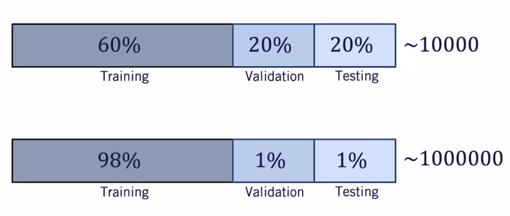</img>
  
  
  - __Reducing the Effect of Underfitting/Overfitting__
    - **Underfitting** (Training loss is high): 
      - Train longer
      - More layers or more parameters per layers
      - Change architecture
      
    - **Overfitting** (Generalization gap is large):
      - More training data (Very expensive work in Self-driving cars)
      - Regularization
      - Change architecture
  
- **Neural Network Regularization**
  - __L2-Norm Parameter Penalty__: Penalty term to the loss function 
  - __Dropout__: Choose a subset of the network nodes to keep in the network
    - Computationally inexpensive but powerful regularization method. 
    - Does not significantly limit the type of the model or training procedure that can be used.
    - Dropout layers are practically implemented in all neural network libraries. 
  - __Early Stopping__

- **Convolutional Neural Networks**
  - Cross-correlation
  - Stride, Padding
  - Max Pooling layer
  - **Advantages**:
    - Convolutional NN are by design, a natural choice to process images.
    - Convolutional layers have less parameters than fully connected layers, reducing the chances of overfitting.
    - Convolutional layers use the same parameters to process every block of the image. Along with pooling layers, this leads to **translation invariance**, which is particularly important for image understanding. 

## Module 4: 2D Object Detection
The two most prevalent application of deep neural networks to self-driving are object detection, including pedestrian, cyclists and vehicle, and sematic segmentation, which associates image pixels with useful labels such as sign, light, curb, road, vehicle, etc. This module presents baseline techniques for object detection and the following module introduce semantic segmentation, both of which can be used to create a complete self-driving car perception pipeline.

- **Object Detection is Not Trivial!**
  - Extent of object is not fully observed!
    - Occlusion: Background objects covered by foreground objects
    - Truncation: Object are out of image boundaries
    
  - Scale: Object size gets smaller as the object moves farther away
  
  - Illumination changes: too bright or too dark

- **Evaluation Metrics**
  - Intersection-Over-Union (IOU): area of intersection of predicted box with a ground truth box, divided by the area of their union.
  - True Positive (TP): Object class score > score threshold, and IOU > IOU threshold.
  - False Positive (FP): Object class score > score threshold, and IOU < IOU threshold. 
  - False Negative (FN): Number of ground truth object not detected by the algorithm
  - Precision: TP/(TP + FP)
  - Recall: TP/(TP + FN)
  - Precision Recall Curve
  - Average Precision (AP)
  

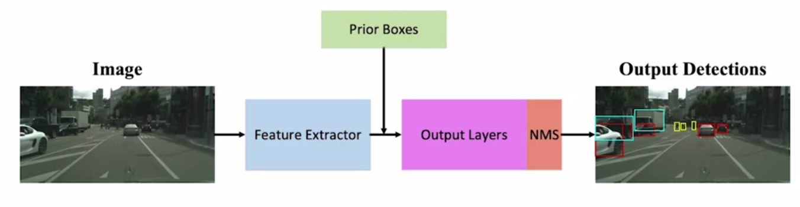</img>
 

- **Feature Extractor**
  - Feature extractors are the most computationally expensive component of the 2D object detector.
  - The output of feature extractors usually has much lower width and height than those of the input image, but much greater depth.
  - Most common extractors are: VGG, ResNet, and Inception
  
- **Prior/Anchor Bounding Boxes**  

- **Ouput layers**: contain a classification head (label) and a Regression head (bounding box coordinate, probability)  

- **MiniBatch Seletction**:
  - Negative anchors target (IOU < 0.4 ):
    - Classification: Background
    - Regression: None
    
  - Positive anchors target (IOU > 0.6):
    - Classification: Category of the ground truth bounding box
    - Regression: Align box parameter with highest IOU ground truth bounding box
    
  - **Problem**: Majority of anchors are negatives results in neural network will label all detections as background.
  - **Solution**: Sample a chosen minibatch size, with 3:1 ratio of negative to positive anchors to eliminate bias toward the negative class
  - Choose negatives with highest classification loss to be included in the minibatch. 

- **Non-max suppression**
  For inference, use Non-Maximum Suppression to get a single output bounding box per object. 
  
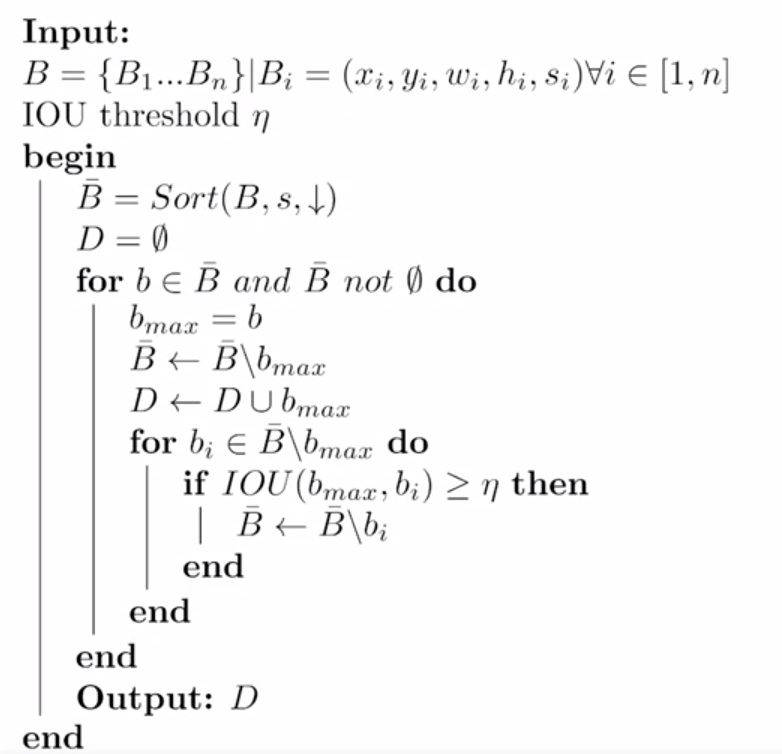</img>
 
  

- **3D Object Detection**
Given a 2D bounding box in an image space and a 3D LiDAR point cloud, we can use the inverse of the camera project matrix to project the corner of the bounding box as rays into 3D space. The polygon intersection of these lines is called a frustum, and usually contains points in 3D that correspond to the object in our image. 

  
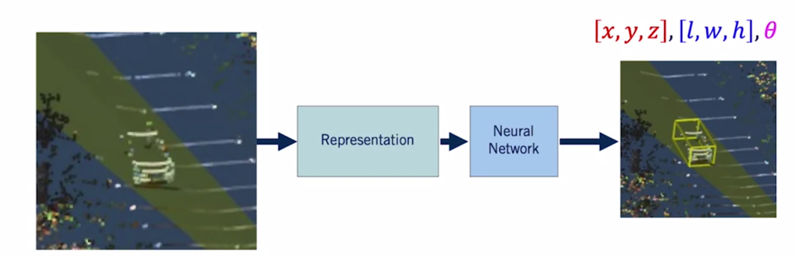</img>
 
  
  - **Why from 2D &rarr; 3D Object detection**:
    - **Advantages**:
      - Allows exploitation of mature 2D object detectors, with high precision and recall.
      - Class already determined from 2D detection.
      - Does not require prior scene knowledge, such as ground plane location.
      
    - **Disadvantages**:
      - The performance of the 3D estimator is bounded by the performance of the 2D detector. 
      - Occlusion and truncation are hard to handle from 2D only.
      - 3D estimator needs to wait for 2D detector, inducing latency in our system.
      
- **2D Object Tracking**
We use image measurements to estimate position of object, but also incorporate position predicted by dynamics, i.e, our expectation of object's motion pattern. 
  **Tracking Assumption**:
    - Camera is not moving instantly to new viewpoint
    - Objects do not disappear and reappear in different places in the scene. 
    - If the camera is moving, there is a gradual change in pose between camera and scene. 
    
  
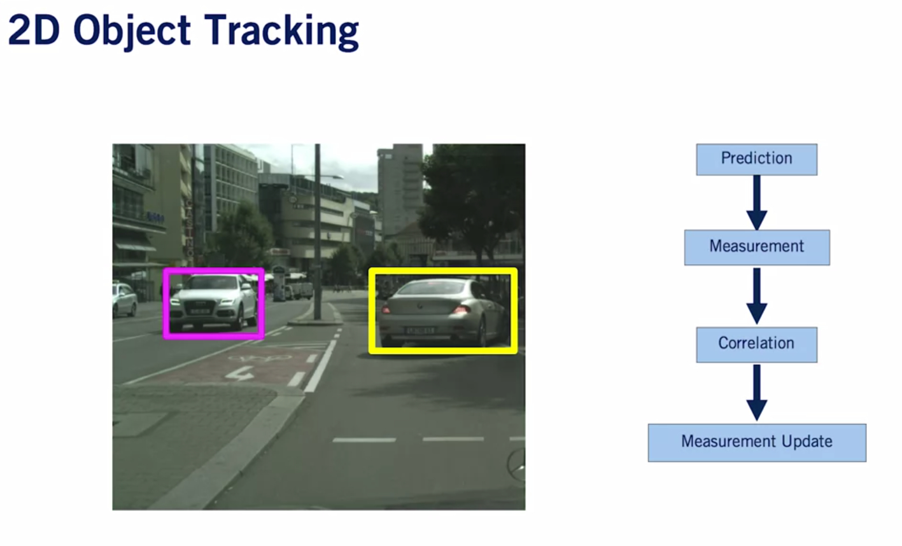</img>
 

- **Object tracking**:
    - **Prediction**: Each object will have predefined **motion model** in image space. 
    - **Correlation**:
      - Get **Measurement Bounding Boxes** from 2D detector.
      - Correlate prediction with the highest IOU measurement. 
    - **Update**: The prediction and measurement are fused ans part of Kalman Filter Network. 
    
    - **Add and terminate**: 
      - For each frame, we start new track if a measurement has no correlated prediction.
      - We also terminate inconsistent tracks, if a predicted object does not correlated with a measurement for a preset number of frames. 
      - The same methodology can be used to track object in 3D!

- **Traffic Sign and Traffic Signal Detection**
  - Traffic signs and signal appear smaller in size compared to cars, two-wheelers, and pedestrians.
  - Traffic signs are highly variable with many classes to be trained on.
  - Traffic signals have different states that are required to be detected. 
  - In addition, traffic signals change state as the car drives. 
  - 2D object detectors can be used to perform traffic sign and traffic signal detection without any modification.
  - However, **multi-stage hierarchical models** have been shown to outperform the standard single state object detectors.
